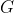
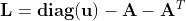
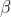

```{r chunk-name, include=FALSE}
knitr::opts_chunk$set(
  collapse = TRUE,
  fig.path = "man/figures/"
)
```


## Description

A collection of tools in `R` to represent and analyse trophic networks in space accross aggregation levels. The package contains a layout algorithm specifically designed for trophic networks, using trophic levels and dimension reduction on diffusion kernel  with .

## Package installation

```{r,echo = TRUE,eval = F}
install_github("MarcOhlmann/metanetwork")
```


## Loading the package
```{r,echo = T,message = F,warning=F}
library(metanetwork)
```
Loading 'igraph' is also strongly recommended 
```{r,echo = T,message = F,warning=F}
library(igraph)
```


# Introduction and basics

## What is a metanetwork ?

In ecological networks literature, metanetwork refers to a set of networks in space. In R package 'metanetwork', we stick to a widespread (however restrictive) case: 

* a potential interaction network (the metaweb, can be built using expert knowledge)
* local abundance tables, local networks are then induced subgraph of the metaweb by local abundances 

Additional information might be considered (and used in 'metanetwork') as:

* a trophic table indicating a hierarchy of nodes of the metaweb, in order to study the 
metanetwork at different aggregation levels

## What 'metanetwork' package provides ?

```{r,echo = TRUE,message=FALSE,warning=FALSE}
#Angola dataset
ggmetanet(meta_angola,beta = 0.05,legend = "Phylum")
```


# Pyramid example

## Generating pyramid data set

### Generating the metaweb an representing it using 'ggnet2'
We first generate a pyramid network using 'igraph' and represent it using 'ggnet2'

```{r,echo = TRUE,message=FALSE,warning=FALSE}
library(igraph)
library(network)
library(intergraph)
library(GGally)

n = 5
#generate a lattice 
g = igraph::make_lattice(dim = 2,length = n,directed = T)
#deleting nodes and edges
nodes_to_rm = c()
for (k in 1:(n-1)){
  nodes_to_rm = c(nodes_to_rm,((k-1)*n+1):(k*n - k))
}
g = delete_vertices(g,nodes_to_rm)
g = delete_edges(g,c("7|12","8|13","9|14","2|5"))
V(g)$name = LETTERS[1:vcount(g)]
#representing the lattice using ggnet package
network = asNetwork(g)
ggnet2(network, arrow.size = 7,size = 3 ,arrow.gap = 0.025, label = T)
```

Notice that 'ggnet2' default layout algorithm (Fruchterman-Reingold algorithm, a force directed algorithm) is non-reproducible and non-oriented: x-axis and y-axis do not have any interpretation

```{r}
ggnet2(network, arrow.size = 7,size = 3 ,arrow.gap = 0.025, label = T)
```

### Generating abundance table
We now generate two local communities (presence/absence in our case)
```{r,echo = TRUE}
#sampling a presence table
presence = rbind(c(1,1,1,1,1,1,0,0,1,0,0,0,0,0,1),
                 c(0,0,0,1,1,1,1,1,1,1,1,1,1,1,1))

rownames(presence) = c('a','b')
colnames(presence) = V(g)$name
```

## Building a metanetwork object
From the lattice metaweb and abundance table, build a S3 object of class 'metanetwork' using `build_metanetwork`

```{r,echo = TRUE}
#building metanetwork object
meta0 = build_metanet(metaweb = g,abTable = presence)
class(g)
class(meta0)
```

method `print_metanet` prints a summary of the considered metanetwork.

```{r}
print(meta0)
```

## Handling metanetworks

### the class 'metanetwork'
A 'metanetwork' object consists in a list of 'igraph' objects:

* metaweb, the metaweb used to build the metanetwork, an 'igraph' object with node attribute `$ab` indicating the local relative abundance of each node and graph attribute `$name`indicating `"metaweb"`
* local networks, a list of 'igraph' objects with node attribute `$ab` indicating the local relative abundance of each node in each network and graph attribute `$name` indicating local network names, that is rownames of the abundance table.

```{r,echo = TRUE}
meta0$b$name
meta0$metaweb$name
#abundances
table(V(meta0$b)$ab)
table(V(meta0$metaweb)$ab)
```

Metaweb node relative abundances are the mean of the local relative abundances.
Addtitional objects like `abTable` or `trophicTable` can be included in a 'metanetwork' object

### computing trophic levels

metanetwork package enables 2D network representation with x-axis equals to trophic levels. To compute trophic levels, metanetwork implements the method describe in: *MacKay, R. S., S. Johnson, and B. Sansom. "How directed is a directed network?." Royal Society open science 7.9 (2020): 201138.*     
To get a solution of dimension 1 (and not of higher dimension), the metaweb needs to be connected. Metanetwork package assumes the metaweb to be connected. 

A method `compute_trophic_levels` allows to compute trophic levels for metanetwork objects.

```{r,echo = TRUE}
#compute trophic levels for metaweb and local networks
meta0 = compute_TL(meta0)
```

Once trophic levels computed, each node of networks of the considered metanetwork have a node attribute `$TL`
```{r,echo = TRUE}
#trophic levels
V(meta0$metaweb)$name
V(meta0$metaweb)$TL
```

## Representing metanetworks

Two layout methods specifically designed for trophic networks are implemented in metanetwork. In both methods, x-axis is the trophic level. Y-axis is computed by reducing diffusion graph kernel, measuring similarity between nodes.
The linear method is a kernel based PCO constrained by the trophic level (using package 'ade4'). In metanetwork, it is called `"TL-kpco"`.    
The non linear is a modification of t-sne algorithm. In this modified algorithm implemented in metanetwork package, high dimension similarity matrix is the diffusion kernel. Then t-sne optimisation process runs by constraining the first axis (x-axis) to be equal to the trophic level. In metanetwork, it is called `"TL-tsne"`.

### Diffusion graph kernel

Diffusion kernel is a similarity matrix between nodes according to a diffusion process. Let  be a directed network,  its adjacency matrix. We note: .   
The laplacian matrix is defined as:    
  
The diffusion kernel is defined as (Kondor & Lafferty, 2002):     
  
with  a positive parameter.
Diffusion kernel measures similarity between pairs of nodes by taking into account paths of arbitrary length. It does not restrict to direct neighbors.

### beta parameter

 is the single parameter of the diffusion kernel. It controls the weight given to the different paths in the diffusion kernel. It is also analogous to the diffusion constant in physics. We'll see through examples its importance in shaping networks.

### `ggmetanet` function

The main metanetwork representation function is `ggmetanet`. It allows representing metaweb and local networks using `ggnet` and both layout algorithms. Default mode is `"TL-tsne"`. `ggmetanet` plots the metaweb of the current metanetwork by default.

```{r, warning = FALSE,echo = TRUE,message= FALSE}
#ggmetanet#
ggmetanet(metanetwork = meta0,beta = 0.1)
```
       

```{r, warning = FALSE,echo = TRUE,message= FALSE}
#ggmetanet#
ggmetanet(metanetwork = meta0,beta = 0.45)
```
   
`ggmetanet` can also represent local networks (with specific layout)
     
```{r, warning = FALSE,echo = TRUE,message= FALSE}
ggmetanet(g = meta0$b,beta = 0.1,metanetwork = meta0)
```

Increasing `beta` squeeze y-axis
```{r, warning = FALSE,echo = TRUE,message= FALSE}
ggmetanet(g = meta0$b,beta = 1,metanetwork = meta0)
```
      
Moreover, it clusters nodes belonging to different 'branches'. They become more and more similar when beta is increased.        

*Representing disconnected networks*

If the metaweb needs to be connected, local networks can be disconnected due to sampling effects. In that case, trophic levels are computed using metaweb trophic levels. The basal species of each connected module has a trophic level equals to its value in the metaweb.        

```{r, warning = FALSE,echo = TRUE,message= FALSE}
ggmetanet(g = meta0$a,beta = 0.45,metanetwork = meta0)
```
      

### `diff_plot` function

In order to compare local networks, a `diff_plot` function is implemented. It colors nodes according to their presence/absence or variation in abundance in both networks.

```{r, warning = FALSE,echo = TRUE,message= FALSE}
diff_plot(g1 = meta0$a,g2 = meta0$b,beta = 0.1,mode = 'TL-tsne',metanetwork = meta0)
```
   
### Changing `ggnet` configuration parameters 

In order to fine tune network plots, it is possible to modify `ggnet` parameters in  metanetwork. An object `ggnet.default` is stored and wraps the different visualisation parameters. Change it to modify the plot.

```{r,warning=F,message=F}
ggnet.custom = ggnet.default
ggnet.custom$edge.size = 3*ggnet.default$edge.size
ggnet.custom$label.size = 7
ggmetanet(beta = 0.1,metanetwork = meta0,
          ggnet.config = ggnet.custom)
```
## Angola data set 

An example using real data is accessible in metanetwork. It consists in the Angoala coastal trophic network from *Angelini, R. & Vaz-Velho, F. (2011).*, abundance data at different time steps (1986 and 2003) and a trophic table, indicating the groups to which species belong.

## angola metanetwork object

angola dataset is lazy loaded in metanetwork. `meta_angola` consists in a object of class `metanetwork`.

```{r}
print_metanet(meta_angola)
```
### `plot_trophic_table` function

Contrary to the pyramid example, angola dataset do have a trophic table, describing nodes memberships in higher relevant groups. In angola dataset, two different taxonomic resolutions are available. Networks can be handled and represented at Species or Phylum level.       
The `plot_trophic_table` function allows representing the tree describing species memberships.

```{r}
ggnet.custom = ggnet.default
ggnet.custom$label.size = 2
plot_trophicTable(meta_angola,ggnet.config = ggnet.custom)
```

### `append_aggregated_network` method

The method `append_aggregated_network` allows computing and appending aggregated networks (at the different available resolutions) to the current metanetwork.


```{r}
meta_angola = append_agg_nets(meta_angola)
print(meta_angola)
```
### Representing aggregated networks, adding a legend to networks

Once computed, `ggmetanet` function allows representing aggregated networks and legending local networks using trophic table. Do not forget to first compute trophic levels.

```{r, message = FALSE, warning = FALSE}
meta_angola = compute_TL(meta_angola)
ggmetanet(g = meta_angola$metaweb_Phylum,beta = 1,metanetwork = meta_angola)
```

Node sizes are proportional to relative abundances. Trophic table allows adding a legend to network at the finest resolution.

```{r, message = FALSE, warning = FALSE}
ggmetanet(g = meta_angola$metaweb,beta = 0.04,legend = 'Phylum',metanetwork = meta_angola)
```

### `diff_plot`

```{r, message=F,warning=F}
diff_plot(g1 = meta_angola$X1986,g2 = meta_angola$X2003,beta = 0.04,metanetwork = meta_angola)
```
       
### `vismetaNetwork` function

metanetwork allows representing trophic networks in interactive way using `visNetwork` function and both layout algorithms. We highly recommend this function to explore large and dense networks. Since outputs of this functions cannot be rendered on this README, they are saved in `./vismetaNetwork` in html format. `x_y_range` argument allows controlling the x-axis and y-axis scale.

```{r,echo=T,eval=F,warning=F,message=F}
vismetaNetwork(metanetwork = meta_angola,beta = 0.04,legend = 'group',x_y_range = c(10,0.05))
```

Interactive visualisation of angola dataset and other trophic networks using `vismetaNetwork` are available at [https://shiny.osug.fr/app/ecological-networks](https://shiny.osug.fr/app/ecological-networks).

## Additional features

### attach_layout function

Since `TL-tsne` layout is stochastic and requires (a bit of) computation times, saving and using the the same layout (for a given $\beta$ value) is recommended. Moreover, it makes easier visual network analysis and comparison since it is fixed.
`attach_layout` function allows saving computed layouts by attaching them as a node attribute.

```{r}
#attaching a layout to the metaweb
meta_angola = attach_layout(metanetwork = meta_angola,beta = 0.05)
#layout is saved as node attribute (only one component since the other one is trophic level)
V(meta_angola$metaweb)$TL
V(meta_angola$metaweb)$layout_beta0.05_1
#ggmetanet uses computed layout
ggmetanet(meta_angola,beta = 0.05,legend = "Phylum")

#attaching a new layout for the same beta value
meta_angola = attach_layout(metanetwork = meta_angola,beta = 0.05)
#ggmetanet with the new 'TL-tsne-run
ggmetanet(meta_angola,beta = 0.05,legend = "Phylum",nrep_ly = 2)

```

Notice that even if the two layouts are quite different in term of global structure, they share some features in terms of local structure.

### Using metaweb layout

Using metaweb layout can ease the representation and comparaison of multiple local networks. 

```{r}
#using metaweb layout to represent a local network
ggmetanet(g = meta_angola$X1986,metanetwork = meta_angola,
          legend = "Phylum",layout_metaweb = T,beta = 0.05)

#using metaweb layout for diffplot
diff_plot(g1 = meta_angola$X1986,g2 = meta_angola$X2003,
          metanetwork = meta_angola,beta = 0.05,
          layout_metaweb = T)
```
 
## Authors

This package is currently developed by Marc Ohlmann from Laboratoire d'Ecologie Alpine, Grenoble and Jimmy Garnier and Laurent Vuillon from Laboratoire de Mathématiques, Chambéry. It is supported by the ANR 'Globnets'.

## Contact

For any bugs, information or feedback, please contact [Marc Ohlmann](marcohlmann _at_ live.fr).

