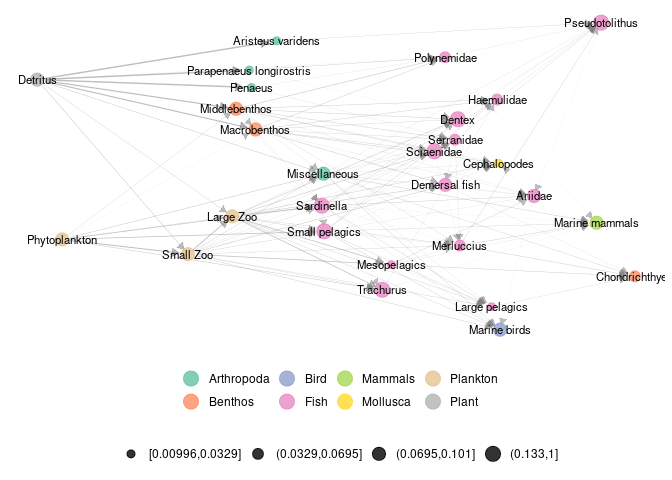
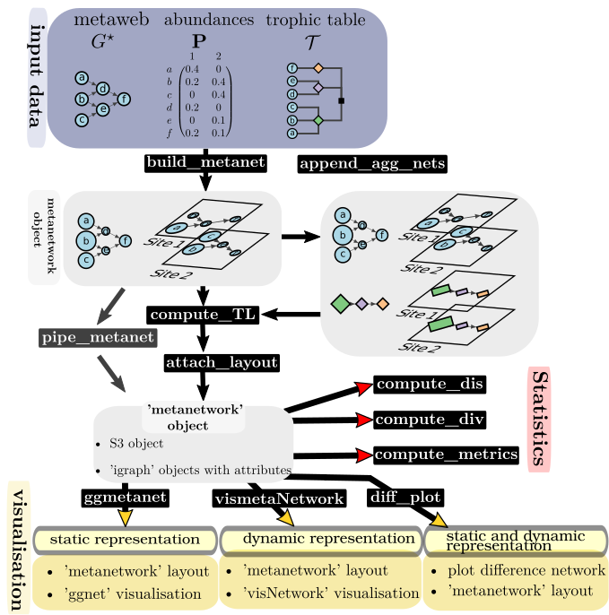

R package ‘metanetwork’
================
Marc Ohlmann
15/03/22

# 

## Description

A collection of tools in `R` to represent and analyse trophic networks
in space across aggregation levels. The package contains a layout
algorithm specifically designed for trophic networks, using trophic
levels and dimension reduction on a diffusion kernel.

## Package installation

``` r
install_github("MarcOhlmann/metanetwork")
```

## Loading the package

``` r
library(metanetwork)
```

Loading ‘igraph’ is also strongly recommended since ‘metanetwork’
objects are built from ‘igraph’ objects

``` r
library(igraph)
```

# Introduction and basics

## What is a metanetwork ?

In ecological networks literature, metanetwork refers to a set of
networks in space. In R package ‘metanetwork’, we stick to a widespread
(however restrictive) case:

-   a potential interaction network (the metaweb, can be built using
    expert knowledge)
-   local abundance tables, local networks are then induced subgraph of
    the metaweb by local abundances

Additional information might be considered (and used in ‘metanetwork’)
as:

-   a trophic table indicating a hierarchy of nodes of the metaweb, in
    order to study the metanetwork at different aggregation levels

See vignettes for application of ‘metanetwork’ on several datasets.

## What ‘metanetwork’ package provides ?

``` r
#Angola dataset
ggmetanet(meta_angola,beta = 0.05,legend = "Phylum")
```

<!-- -->

## ‘metanetwork’ map



## Authors

This package is currently developed by Marc Ohlmann from Laboratoire
d’Ecologie Alpine, Grenoble and Jimmy Garnier and Laurent Vuillon from
Laboratoire de Mathématiques, Chambéry. It is supported by the ANR
[Globnets](https://anr.fr/Projet-ANR-16-CE02-0009) and ANR
[Econet](https://cmatias.perso.math.cnrs.fr/ANR_EcoNet.html).
