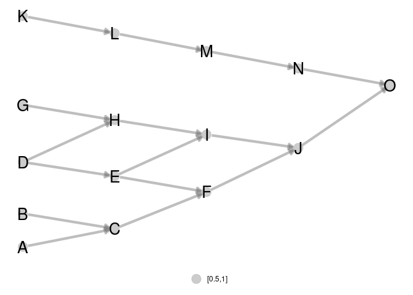

R package ‘metanetwork’
================
Marc Ohlmann
22/6/2021

## Description

A collection of tools in `R` to represent and analyse trophic networks
in space accross aggregation levels. The package contains a layout
algorithm specifically designed for trophic networks, using trophic
levels and dimension reduction on diffusion kernel with .

## Package installation

``` r
install_github("MarcOhlmann/metanetwork")
```

## Loading the package

``` r
library(metanetwork)
```

Loading ‘igraph’ is also strongly recommended

``` r
library(igraph)
```

# Introduction and basics

## What is a metanetwork ?

In ecological networks literature, metanetwork refers to a set of
networks in space. In R package ‘metanetwork’, we stick to a widespread
(however restrictive) case:

-   a potential interaction network (the metaweb, can be built using
    expert knowledge)
-   local abundance tables, local networks are then induced subgraph of
    the metaweb by local abundances

Additional information might be considered (and used in ‘metanetwork’)
as:

-   a trophic table indicating a hierarchy of nodes of the metaweb, in
    order to study the metanetwork at different aggregation levels

## What ‘metanetwork’ package provides ?

``` r
#Angola dataset
ggmetanet(meta_angola,beta = 0.05,legend = "Phylum")
```

<!-- -->

# Pyramid example

## Generating pyramid data set

### Generating the metaweb an representing it using ‘ggnet2’

We first generate a pyramid network using ‘igraph’ and represent it
using ‘ggnet2’

``` r
library(igraph)
library(network)
library(intergraph)
library(GGally)

n = 5
#generate a lattice 
g = igraph::make_lattice(dim = 2,length = n,directed = T)
#deleting nodes and edges
nodes_to_rm = c()
for (k in 1:(n-1)){
  nodes_to_rm = c(nodes_to_rm,((k-1)*n+1):(k*n - k))
}
g = delete_vertices(g,nodes_to_rm)
g = delete_edges(g,c("7|12","8|13","9|14","2|5"))
V(g)$name = LETTERS[1:vcount(g)]
#representing the lattice using ggnet package
network = asNetwork(g)
ggnet2(network, arrow.size = 7,size = 3 ,arrow.gap = 0.025, label = T)
```

<!-- -->

Notice that ‘ggnet2’ default layout algorithm (Fruchterman-Reingold
algorithm, a force directed algorithm) is non-reproducible and
non-oriented: x-axis and y-axis do not have any interpretation

``` r
ggnet2(network, arrow.size = 7,size = 3 ,arrow.gap = 0.025, label = T)
```

<!-- -->

### Generating abundance table

We now generate two local communities (presence/absence in our case)

``` r
#sampling a presence table
presence = rbind(c(1,1,1,1,1,1,0,0,1,0,0,0,0,0,1),
                 c(0,0,0,1,1,1,1,1,1,1,1,1,1,1,1))

rownames(presence) = c('a','b')
colnames(presence) = V(g)$name
```

## Building a metanetwork object

From the lattice metaweb and abundance table, build a S3 object of class
‘metanetwork’ using `build_metanetwork`

``` r
#building metanetwork object
meta0 = build_metanet(metaweb = g,abTable = presence)
class(g)
```

    ## [1] "igraph"

``` r
class(meta0)
```

    ## [1] "metanetwork"

method `print_metanet` prints a summary of the considered metanetwork.

``` r
print(meta0)
```

    ## $metaweb
    ## IGRAPH d5efca3 DNW- 15 16 -- metaweb
    ## + attr: name (g/c), dimvector (g/n), nei (g/n), mutual (g/l), circular
    ## | (g/l), name (v/c), ab (v/n), weight (e/n)
    ## + edges from d5efca3 (vertex names):
    ##  [1] A->C B->C C->F D->E D->H E->F E->I F->J G->H H->I I->J J->O K->L L->M M->N
    ## [16] N->O
    ## 
    ## $abTable
    ##   A B C D E F G H I J K L M N O
    ## a 1 1 1 1 1 1 0 0 1 0 0 0 0 0 1
    ## b 0 0 0 1 1 1 1 1 1 1 1 1 1 1 1
    ## 
    ## $trophicTable
    ## NULL
    ## 
    ## $covariable
    ## NULL
    ## 
    ## $a
    ## IGRAPH a651388 DNW- 8 6 -- a
    ## + attr: name (g/c), dimvector (g/n), nei (g/n), mutual (g/l), circular
    ## | (g/l), res (g/x), name (v/c), ab (v/n), weight (e/n)
    ## + edges from a651388 (vertex names):
    ## [1] A->C B->C C->F D->E E->F E->I
    ## 
    ## $b
    ## IGRAPH bd9ee08 DNW- 12 13 -- b
    ## + attr: name (g/c), dimvector (g/n), nei (g/n), mutual (g/l), circular
    ## | (g/l), res (g/x), name (v/c), ab (v/n), weight (e/n)
    ## + edges from bd9ee08 (vertex names):
    ##  [1] D->E D->H E->F E->I F->J G->H H->I I->J J->O K->L L->M M->N N->O
    ## 
    ## attr(,"class")
    ## [1] "metanetwork"

## Handling metanetworks

### the class ‘metanetwork’

A ‘metanetwork’ object consists in a list of ‘igraph’ objects:

-   metaweb, the metaweb used to build the metanetwork, an ‘igraph’
    object with node attribute `$ab` indicating the local relative
    abundance of each node and graph attribute `$name`indicating
    `"metaweb"`
-   local networks, a list of ‘igraph’ objects with node attribute `$ab`
    indicating the local relative abundance of each node in each network
    and graph attribute `$name` indicating local network names, that is
    rownames of the abundance table.

``` r
meta0$b$name
```

    ## [1] "b"

``` r
meta0$metaweb$name
```

    ## [1] "metaweb"

``` r
#abundances
table(V(meta0$b)$ab)
```

    ## 
    ## 0.0833333333333333 
    ##                 12

``` r
table(V(meta0$metaweb)$ab)
```

    ## 
    ## 0.05  0.1 
    ##   10    5

Metaweb node relative abundances are the mean of the local relative
abundances. Addtitional objects like `abTable` or `trophicTable` can be
included in a ‘metanetwork’ object

### computing trophic levels

metanetwork package enables 2D network representation with x-axis equals
to trophic levels. To compute trophic levels, metanetwork implements the
method describe in: *MacKay, R. S., S. Johnson, and B. Sansom. “How
directed is a directed network?.” Royal Society open science 7.9 (2020):
201138.*  
To get a solution of dimension 1 (and not of higher dimension), the
metaweb needs to be connected. Metanetwork package assumes the metaweb
to be connected.

A method `compute_trophic_levels` allows to compute trophic levels for
metanetwork objects.

``` r
#compute trophic levels for metaweb and local networks
meta0 = compute_TL(meta0)
```

Once trophic levels computed, each node of networks of the considered
metanetwork have a node attribute `$TL`

``` r
#trophic levels
V(meta0$metaweb)$name
```

    ##  [1] "A" "B" "C" "D" "E" "F" "G" "H" "I" "J" "K" "L" "M" "N" "O"

``` r
V(meta0$metaweb)$TL
```

    ##  [1] 0.000000e+00 0.000000e+00 1.000000e+00 4.440892e-16 1.000000e+00
    ##  [6] 2.000000e+00 4.440892e-16 1.000000e+00 2.000000e+00 3.000000e+00
    ## [11] 0.000000e+00 1.000000e+00 2.000000e+00 3.000000e+00 4.000000e+00

## Representing metanetworks

Two layout methods specifically designed for trophic networks are
implemented in metanetwork. In both methods, x-axis is the trophic
level. Y-axis is computed by reducing diffusion graph kernel, measuring
similarity between nodes. The linear method is a kernel based PCO
constrained by the trophic level (using package ‘ade4’). In metanetwork,
it is called `"TL-kpco"`.  
The non linear is a modification of t-sne algorithm. In this modified
algorithm implemented in metanetwork package, high dimension similarity
matrix is the diffusion kernel. Then t-sne optimisation process runs by
constraining the first axis (x-axis) to be equal to the trophic level.
In metanetwork, it is called `"TL-tsne"`.

### Diffusion graph kernel

Diffusion kernel is a similarity matrix between nodes according to a
diffusion process. Let  be a directed network,
 its adjacency matrix. We note:
.  
The laplacian matrix is defined as:  
  
The diffusion kernel is defined as (Kondor & Lafferty, 2002):  
  
with  a positive parameter. Diffusion
kernel measures similarity between pairs of nodes by taking into account
paths of arbitrary length. It does not restrict to direct neighbors.

### beta parameter

 is the single parameter of the diffusion
kernel. It controls the weight given to the different paths in the
diffusion kernel. It is also analogous to the diffusion constant in
physics. We’ll see through examples its importance in shaping networks.

### `ggmetanet` function

The main metanetwork representation function is `ggmetanet`. It allows
representing metaweb and local networks using `ggnet` and both layout
algorithms. Default mode is `"TL-tsne"`. `ggmetanet` plots the metaweb
of the current metanetwork by default.

``` r
#ggmetanet#
ggmetanet(metanetwork = meta0,beta = 0.1)
```

<!-- -->

``` r
#ggmetanet#
ggmetanet(metanetwork = meta0,beta = 0.45)
```

<!-- -->

`ggmetanet` can also represent local networks (with specific layout)

``` r
ggmetanet(g = meta0$b,beta = 0.1,metanetwork = meta0)
```

<!-- -->

Increasing `beta` squeeze y-axis

``` r
ggmetanet(g = meta0$b,beta = 1,metanetwork = meta0)
```

<!-- -->

Moreover, it clusters nodes belonging to different ‘branches’. They
become more and more similar when beta is increased.

*Representing disconnected networks*

If the metaweb needs to be connected, local networks can be disconnected
due to sampling effects. In that case, trophic levels are computed using
metaweb trophic levels. The basal species of each connected module has a
trophic level equals to its value in the metaweb.

``` r
ggmetanet(g = meta0$a,beta = 0.45,metanetwork = meta0)
```

<!-- -->

### `diff_plot` function

In order to compare local networks, a `diff_plot` function is
implemented. It colors nodes according to their presence/absence or
variation in abundance in both networks.

``` r
diff_plot(g1 = meta0$a,g2 = meta0$b,beta = 0.1,mode = 'TL-tsne',metanetwork = meta0)
```

<!-- -->

### Changing `ggnet` configuration parameters

In order to fine tune network plots, it is possible to modify `ggnet`
parameters in metanetwork. An object `ggnet.default` is stored and wraps
the different visualisation parameters. Change it to modify the plot.

``` r
ggnet.custom = ggnet.default
ggnet.custom$edge.size = 3*ggnet.default$edge.size
ggnet.custom$label.size = 7
ggmetanet(beta = 0.1,metanetwork = meta0,
          ggnet.config = ggnet.custom)
```

<!-- --> ## Angola data set

An example using real data is accessible in metanetwork. It consists in
the Angoala coastal trophic network from *Angelini, R. & Vaz-Velho, F.
(2011).*, abundance data at different time steps (1986 and 2003) and a
trophic table, indicating the groups to which species belong.

## angola metanetwork object

angola dataset is lazy loaded in metanetwork. `meta_angola` consists in
a object of class `metanetwork`.

``` r
print_metanet(meta_angola)
```

    ## object of class metanetwork

    ## metaweb has 28 nodes and 127 edges 
    ## 2 local networks 
    ## available resolutions are: Species Phylum

### `plot_trophic_table` function

Contrary to the pyramid example, angola dataset do have a trophic table,
describing nodes memberships in higher relevant groups. In angola
dataset, two different taxonomic resolutions are available. Networks can
be handled and represented at Species or Phylum level.  
The `plot_trophic_table` function allows representing the tree
describing species memberships.

``` r
ggnet.custom = ggnet.default
ggnet.custom$label.size = 2
plot_trophicTable(meta_angola,ggnet.config = ggnet.custom)
```

<!-- -->

### `append_aggregated_network` method

The method `append_aggregated_network` allows computing and appending
aggregated networks (at the different available resolutions) to the
current metanetwork.

``` r
meta_angola = append_agg_nets(meta_angola)
print(meta_angola)
```

    ## $metaweb
    ## IGRAPH f873652 DNW- 28 127 -- metaweb
    ## + attr: res (g/c), name (g/c), name (v/c), ab (v/n), TL (v/n), weight
    ## | (e/n)
    ## + edges from f873652 (vertex names):
    ##  [1] Trachurus ->Haemulidae     Trachurus ->Marine mammals
    ##  [3] Sardinella->Ariidae        Sardinella->Merluccius    
    ##  [5] Sardinella->Pseudotolithus Sardinella->Serranidae    
    ##  [7] Sardinella->Haemulidae     Sardinella->Small pelagics
    ##  [9] Sardinella->Large pelagics Sardinella->Cephalopodes  
    ## [11] Sardinella->Marine mammals Sardinella->Marine birds  
    ## [13] Sciaenidae->Merluccius     Sciaenidae->Serranidae    
    ## + ... omitted several edges
    ## 
    ## $abTable
    ##       Trachurus Sardinella Sciaenidae    Ariidae Merluccius      Dentex
    ## X1986 0.3100092  0.3144169 0.02424242 0.01689624 0.02938476 0.007346189
    ## X2003 0.1465201  0.1792717 0.06895066 0.02413273 0.00258565 0.068950657
    ##       Pseudotolithus  Serranidae Polynemidae Parapenaeus longirostris
    ## X1986    0.004407713 0.004407713 0.005876951              0.009550046
    ## X2003    0.072398190 0.018961431 0.017237664              0.006377936
    ##        Haemulidae Aristeus varidens Small pelagics Mesopelagics Large pelagics
    ## X1986 0.008080808       0.003673095     0.03746556  0.001469238    0.004407713
    ## X2003 0.020685197       0.005860806     0.07239819  0.003447533    0.003275156
    ##       Demersal fish Chondrichthyes Cephalopodes Miscellaneous     Penaeus
    ## X1986   0.005876951    0.002938476 0.0007346189   0.007346189 0.001469238
    ## X2003   0.034475329    0.013790131 0.0068950657   0.027580263 0.006205559
    ##       Marine mammals Marine birds Macrobenthos Middlebenthos Large Zoo
    ## X1986          0.025        0.025        0.025         0.025     0.025
    ## X2003          0.025        0.025        0.025         0.025     0.025
    ##       Small Zoo Phytoplankton Detritus
    ## X1986     0.025         0.025    0.025
    ## X2003     0.025         0.025    0.025
    ## 
    ## $trophicTable
    ##                                           Species     Phylum
    ## Ariidae                                   Ariidae       Fish
    ## Aristeus varidens               Aristeus varidens Arthropoda
    ## Cephalopodes                         Cephalopodes   Mollusca
    ## Chondrichthyes                     Chondrichthyes    Benthos
    ## Demersal fish                       Demersal fish       Fish
    ## Dentex                                     Dentex       Fish
    ## Detritus                                 Detritus      Plant
    ## Haemulidae                             Haemulidae       Fish
    ## Large pelagics                     Large pelagics       Fish
    ## Large Zoo                               Large Zoo   Plankton
    ## Macrobenthos                         Macrobenthos    Benthos
    ## Marine birds                         Marine birds       Bird
    ## Marine mammals                     Marine mammals    Mammals
    ## Merluccius                             Merluccius       Fish
    ## Mesopelagics                         Mesopelagics       Fish
    ## Middlebenthos                       Middlebenthos    Benthos
    ## Miscellaneous                       Miscellaneous Arthropoda
    ## Parapenaeus longirostris Parapenaeus longirostris Arthropoda
    ## Penaeus                                   Penaeus Arthropoda
    ## Phytoplankton                       Phytoplankton   Plankton
    ## Polynemidae                           Polynemidae       Fish
    ## Pseudotolithus                     Pseudotolithus       Fish
    ## Sardinella                             Sardinella       Fish
    ## Sciaenidae                             Sciaenidae       Fish
    ## Serranidae                             Serranidae       Fish
    ## Small pelagics                     Small pelagics       Fish
    ## Small Zoo                               Small Zoo   Plankton
    ## Trachurus                               Trachurus       Fish
    ## 
    ## $covariable
    ## NULL
    ## 
    ## $X1986
    ## IGRAPH eeeeb2e DNW- 28 127 -- X1986
    ## + attr: res (g/c), name (g/c), name (v/c), ab (v/n), TL (v/n), weight
    ## | (e/n)
    ## + edges from eeeeb2e (vertex names):
    ##  [1] Trachurus ->Haemulidae     Trachurus ->Marine mammals
    ##  [3] Sardinella->Ariidae        Sardinella->Merluccius    
    ##  [5] Sardinella->Pseudotolithus Sardinella->Serranidae    
    ##  [7] Sardinella->Haemulidae     Sardinella->Small pelagics
    ##  [9] Sardinella->Large pelagics Sardinella->Cephalopodes  
    ## [11] Sardinella->Marine mammals Sardinella->Marine birds  
    ## [13] Sciaenidae->Merluccius     Sciaenidae->Serranidae    
    ## + ... omitted several edges
    ## 
    ## $X2003
    ## IGRAPH b673113 DNW- 28 127 -- X2003
    ## + attr: res (g/c), name (g/c), name (v/c), ab (v/n), TL (v/n), weight
    ## | (e/n)
    ## + edges from b673113 (vertex names):
    ##  [1] Trachurus ->Haemulidae     Trachurus ->Marine mammals
    ##  [3] Sardinella->Ariidae        Sardinella->Merluccius    
    ##  [5] Sardinella->Pseudotolithus Sardinella->Serranidae    
    ##  [7] Sardinella->Haemulidae     Sardinella->Small pelagics
    ##  [9] Sardinella->Large pelagics Sardinella->Cephalopodes  
    ## [11] Sardinella->Marine mammals Sardinella->Marine birds  
    ## [13] Sciaenidae->Merluccius     Sciaenidae->Serranidae    
    ## + ... omitted several edges
    ## 
    ## $metaweb_Phylum
    ## IGRAPH 47e0994 DNW- 8 24 -- metaweb
    ## + attr: res (g/c), name (g/c), name (v/c), ab (v/n), weight (e/n)
    ## + edges from 47e0994 (vertex names):
    ##  [1] Arthropoda->Benthos    Arthropoda->Bird       Arthropoda->Fish      
    ##  [4] Arthropoda->Mammals    Arthropoda->Mollusca   Benthos   ->Arthropoda
    ##  [7] Benthos   ->Benthos    Benthos   ->Fish       Benthos   ->Mollusca  
    ## [10] Fish      ->Benthos    Fish      ->Bird       Fish      ->Fish      
    ## [13] Fish      ->Mammals    Fish      ->Mollusca   Plankton  ->Arthropoda
    ## [16] Plankton  ->Benthos    Plankton  ->Bird       Plankton  ->Fish      
    ## [19] Plankton  ->Mollusca   Plankton  ->Plankton   Plant     ->Arthropoda
    ## [22] Plant     ->Benthos    Plant     ->Fish       Plant     ->Plankton  
    ## 
    ## $X1986_Phylum
    ## IGRAPH 508456f DNW- 8 24 -- X1986
    ## + attr: res (g/c), name (g/c), name (v/c), ab (v/n), weight (e/n)
    ## + edges from 508456f (vertex names):
    ##  [1] Arthropoda->Benthos    Arthropoda->Bird       Arthropoda->Fish      
    ##  [4] Arthropoda->Mammals    Arthropoda->Mollusca   Benthos   ->Arthropoda
    ##  [7] Benthos   ->Benthos    Benthos   ->Fish       Benthos   ->Mollusca  
    ## [10] Fish      ->Benthos    Fish      ->Bird       Fish      ->Fish      
    ## [13] Fish      ->Mammals    Fish      ->Mollusca   Plankton  ->Arthropoda
    ## [16] Plankton  ->Benthos    Plankton  ->Bird       Plankton  ->Fish      
    ## [19] Plankton  ->Mollusca   Plankton  ->Plankton   Plant     ->Arthropoda
    ## [22] Plant     ->Benthos    Plant     ->Fish       Plant     ->Plankton  
    ## 
    ## $X2003_Phylum
    ## IGRAPH d8170a2 DNW- 8 24 -- X2003
    ## + attr: res (g/c), name (g/c), name (v/c), ab (v/n), weight (e/n)
    ## + edges from d8170a2 (vertex names):
    ##  [1] Arthropoda->Benthos    Arthropoda->Bird       Arthropoda->Fish      
    ##  [4] Arthropoda->Mammals    Arthropoda->Mollusca   Benthos   ->Arthropoda
    ##  [7] Benthos   ->Benthos    Benthos   ->Fish       Benthos   ->Mollusca  
    ## [10] Fish      ->Benthos    Fish      ->Bird       Fish      ->Fish      
    ## [13] Fish      ->Mammals    Fish      ->Mollusca   Plankton  ->Arthropoda
    ## [16] Plankton  ->Benthos    Plankton  ->Bird       Plankton  ->Fish      
    ## [19] Plankton  ->Mollusca   Plankton  ->Plankton   Plant     ->Arthropoda
    ## [22] Plant     ->Benthos    Plant     ->Fish       Plant     ->Plankton  
    ## 
    ## attr(,"class")
    ## [1] "metanetwork"

### Representing aggregated networks, adding a legend to networks

Once computed, `ggmetanet` function allows representing aggregated
networks and legending local networks using trophic table. Do not forget
to first compute trophic levels.

``` r
meta_angola = compute_TL(meta_angola)
ggmetanet(g = meta_angola$metaweb_Phylum,beta = 1,metanetwork = meta_angola)
```

<!-- -->

Node sizes are proportional to relative abundances. Trophic table allows
adding a legend to network at the finest resolution.

``` r
ggmetanet(g = meta_angola$metaweb,beta = 0.04,legend = 'Phylum',metanetwork = meta_angola)
```

<!-- -->

### `diff_plot`

``` r
diff_plot(g1 = meta_angola$X1986,g2 = meta_angola$X2003,beta = 0.04,metanetwork = meta_angola)
```

<!-- -->

### `vismetaNetwork` function

metanetwork allows representing trophic networks in interactive way
using `visNetwork` function and both layout algorithms. We highly
recommend this function to explore large and dense networks. Since
outputs of this functions cannot be rendered on this README, they are
saved in `./vismetaNetwork` in html format. `x_y_range` argument allows
controlling the x-axis and y-axis scale.

``` r
vismetaNetwork(metanetwork = meta_angola,beta = 0.04,legend = 'group',x_y_range = c(10,0.05))
```

Interactive visualisation of angola dataset and other trophic networks
using `vismetaNetwork` are available at
<https://shiny.osug.fr/app/ecological-networks>.

## Additional features

### attach_layout function

Since `TL-tsne` layout is stochastic and requires (a bit of) computation
times, saving and using the the same layout (for a given *β* value) is
recommended. Moreover, it makes easier visual network analysis and
comparison since it is fixed. `attach_layout` function allows saving
computed layouts by attaching them as a node attribute.

``` r
#attaching a layout to the metaweb
meta_angola = attach_layout(metanetwork = meta_angola,beta = 0.05)
```

    ## beta = 0.05

    ## Epoch: Iteration #100 error is: 907.410775022321

    ## Epoch: Iteration #200 error is: 217.150829821012

    ## Epoch: Iteration #300 error is: 217.280059129137

``` r
#layout is saved as node attribute (only one component since the other one is trophic level)
V(meta_angola$metaweb)$TL
```

    ##  [1] 1.5819853 1.3046314 1.8207464 2.2772862 1.9374378 1.9280135 2.5847122
    ##  [8] 1.9150426 1.8696796 0.9721697 2.1079731 1.0974520 1.3157930 1.6233394
    ## [15] 2.0829452 1.8709379 2.7391262 2.1144788 1.3122002 0.9820602 2.5636889
    ## [22] 2.1213395 1.0005468 0.9115165 0.8937117 0.6906842 0.1142234 0.0000000

``` r
V(meta_angola$metaweb)$layout_beta0.05_1
```

    ## NULL

``` r
#ggmetanet uses computed layout
ggmetanet(meta_angola,beta = 0.05,legend = "Phylum")
```

    ## mode is TL-tsne

<!-- -->

``` r
#attaching a new layout for the same beta value
meta_angola = attach_layout(metanetwork = meta_angola,beta = 0.05)
```

    ## beta = 0.05

    ## Epoch: Iteration #100 error is: 907.41077501653

    ## Epoch: Iteration #200 error is: 217.1059313833

    ## Epoch: Iteration #300 error is: 217.232811268805

``` r
#ggmetanet with the new 'TL-tsne-run
ggmetanet(meta_angola,beta = 0.05,legend = "Phylum",nrep_ly = 2)
```

    ## mode is TL-tsne

<!-- -->

Notice that even if the two layouts are quite different in term of
global structure, they share some features in terms of local structure.

### Using metaweb layout

Using metaweb layout can ease the representation and comparaison of
multiple local networks.

``` r
#using metaweb layout to represent a local network
ggmetanet(g = meta_angola$X1986,metanetwork = meta_angola,
          legend = "Phylum",layout_metaweb = T,beta = 0.05)
```

    ## mode is TL-tsne

<!-- -->

``` r
#using metaweb layout for diffplot
diff_plot(g1 = meta_angola$X1986,g2 = meta_angola$X2003,
          metanetwork = meta_angola,beta = 0.05,
          layout_metaweb = T)
```

    ## mode is TL-tsne

    ## plotting: X1986_Species - X2003_Species

    ## mode is TL-tsne

<!-- -->

## Authors

This package is currently developed by Marc Ohlmann from Laboratoire
d’Ecologie Alpine, Grenoble and Jimmy Garnier and Laurent Vuillon from
Laboratoire de Mathématiques, Chambéry. It is supported by the ANR
‘Globnets’.

## Contact

For any bugs, information or feedback, please contact [Marc
Ohlmann](marcohlmann%20_at_%20live.fr).
