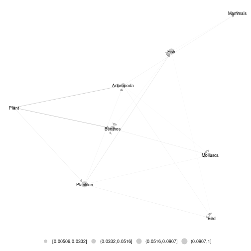
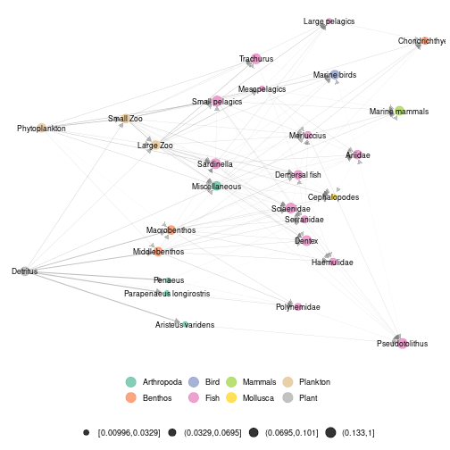
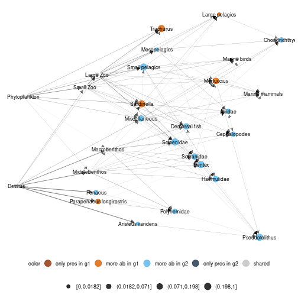
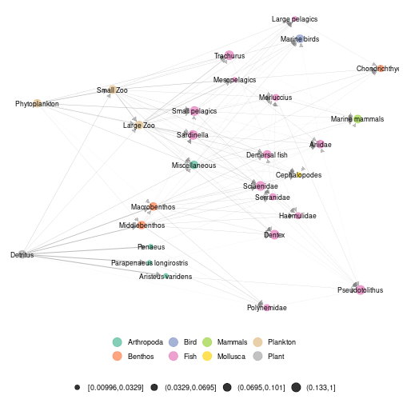
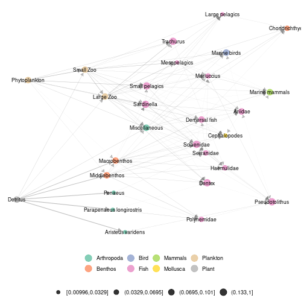
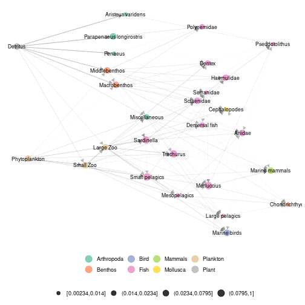
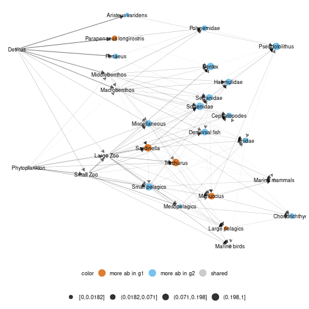

## Angola data set 

An example using real data is accessible in metanetwork. It consists in the Angoala coastal trophic network from *Angelini, R. & Vaz-Velho, F. (2011).*, abundance data at different time steps (1986 and 2003) and a trophic table, indicating the groups to which species belong.


```r
library(metanetwork)
library(igraph)
```


## angola metanetwork object

angola dataset is lazy loaded in metanetwork. `meta_angola` consists in a object of class `metanetwork`.


```r
data(meta_angola)
print(meta_angola)
```

```
## metaweb has 28 nodes and 127 edges 
## 2 local networks 
## available resolutions are: Species Phylum
```

### `plot_trophic_table` function

Contrary to the pyramid example, angola dataset do have a trophic table, describing nodes memberships in higher relevant groups. In angola dataset, two different taxonomic resolutions are available. Networks can be handled and represented at Species or Phylum level.       
The `plot_trophic_table` function allows representing the tree describing species memberships.


```r
ggnet.custom = ggnet.default
ggnet.custom$label.size = 2
plot_trophicTable(meta_angola,ggnet.config = ggnet.custom)
```


### `append_agg_nets` method

The method `append_agg_nets` allows computing and appending aggregated networks (at the different available resolutions) to the current metanetwork.


```r
meta_angola = append_agg_nets(meta_angola)
print(meta_angola)
```

```
## metaweb has 28 nodes and 127 edges 
## 2 local networks 
## available resolutions are: Species Phylum
```

### Representing aggregated networks, adding a legend to networks

Once computed, `ggmetanet` function allows representing aggregated networks and legending local networks using trophic table. Do not forget to first compute trophic levels.


```r
meta_angola = compute_TL(meta_angola)
ggmetanet(g = meta_angola$metaweb_Phylum,beta = 1,metanetwork = meta_angola)
```



Node sizes are proportional to relative abundances. Trophic table allows adding a legend to network at the finest resolution.


```r
ggmetanet(g = meta_angola$metaweb,beta = 0.04,legend = 'Phylum',metanetwork = meta_angola)
```



### `diff_plot`

To represent difference between local networks, use `diff_plot()` function.


```r
diff_plot(g1 = meta_angola$X1986,g2 = meta_angola$X2003,beta = 0.04,metanetwork = meta_angola)
```


       
### `vismetaNetwork` function

metanetwork allows representing trophic networks in interactive way using `visNetwork` function and both layout algorithms. We highly recommend this function to explore large and dense networks. Since outputs of this functions cannot be rendered on this README, they are saved in `./vismetaNetwork` in html format. `x_y_range` argument allows controlling the x-axis and y-axis scale.


```r
vismetaNetwork(metanetwork = meta_angola,beta = 0.04,legend = 'group',x_y_range = c(10,0.05))
```

Interactive visualisation of angola dataset and other trophic networks using `vismetaNetwork` are available at [https://shiny.osug.fr/app/ecological-networks](https://shiny.osug.fr/app/ecological-networks).

## Additional features

### attach_layout function

Since `TL-tsne` layout is stochastic and requires (a bit of) computation times, saving and using the the same layout (for a given $\beta$ value) is recommended. Moreover, it makes easier visual network analysis and comparison since it is fixed.
`attach_layout` function allows saving computed layouts by attaching them as a node attribute.


```r
#attaching a layout to the metaweb
meta_angola = attach_layout(metanetwork = meta_angola,beta = 0.05)
#layout is saved as node attribute (only one component since the other one is trophic level)
V(meta_angola$metaweb)$TL
```

```
##  [1] 1.5819853 1.3046314 1.8207464 2.2772862 1.9374378 1.9280135 2.5847122
##  [8] 1.9150426 1.8696796 0.9721697 2.1079731 1.0974520 1.3157930 1.6233394
## [15] 2.0829452 1.8709379 2.7391262 2.1144788 1.3122002 0.9820602 2.5636889
## [22] 2.1213395 1.0005468 0.9115165 0.8937117 0.6906842 0.1142234 0.0000000
```

```r
V(meta_angola$metaweb)$layout_beta0.05_1
```

```
## NULL
```

```r
#ggmetanet uses computed layout
ggmetanet(meta_angola,beta = 0.05,legend = "Phylum")
```



```r
#attaching a new layout for the same beta value
meta_angola = attach_layout(metanetwork = meta_angola,beta = 0.05)
#ggmetanet with the new 'TL-tsne-run
ggmetanet(meta_angola,beta = 0.05,legend = "Phylum",nrep_ly = 2)
```



Notice that even if the two layouts are quite different in term of global structure, they share some features in terms of local structure.

### Using metaweb layout

Using metaweb layout can ease the representation and comparison of multiple local networks. 


```r
#using metaweb layout to represent a local network
ggmetanet(g = meta_angola$X1986,metanetwork = meta_angola,
          legend = "Phylum",layout_metaweb = T,beta = 0.05)
```



```r
#using metaweb layout for diffplot
diff_plot(g1 = meta_angola$X1986,g2 = meta_angola$X2003,
          metanetwork = meta_angola,beta = 0.05,
          layout_metaweb = T)
```


 
