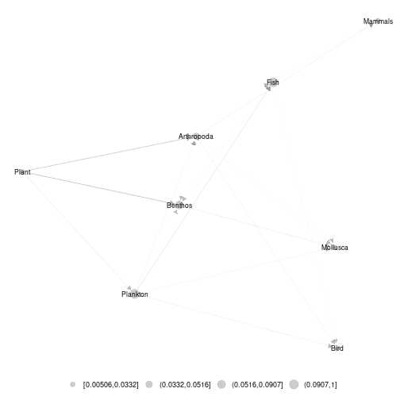
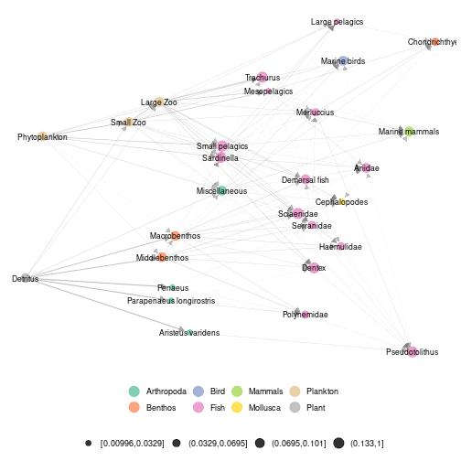
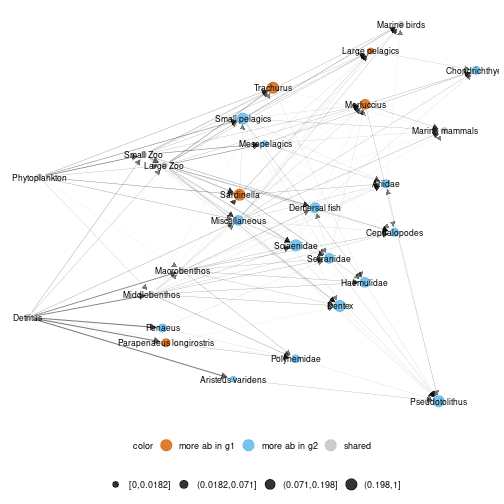
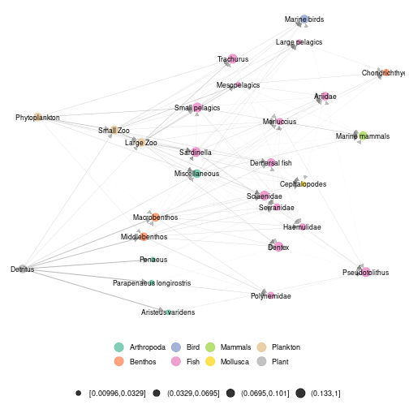

## Angola data set 

An example using real data is accessible in metanetwork. It consists in the Angoala coastal trophic network from *Angelini, R. & Vaz-Velho, F. (2011).*, abundance data at different time steps (1986 and 2003) and a trophic table, indicating the groups to which species belong.


```r
library(metanetwork)
library(igraph)
```


## Loading the dataset


```r
data("meta_angola")
class(meta_angola)
```

```
## [1] "metanetwork"
```

```r
print(meta_angola)
```

```
## metaweb has 28 nodes and 127 edges 
## 2 local networks 
## available resolutions are: Species Phylum
```

### `plot_trophic_table` function

Contrary to the pyramid example, angola dataset do have a trophic table, describing nodes memberships in higher relevant groups. In angola dataset, two different taxonomic resolutions are available. Networks can be handled and represented at Species or Phylum level.       
The `plot_trophic_table` function allows representing the tree describing species memberships.


```r
ggnet.custom = ggnet.default
ggnet.custom$label.size = 2
plot_trophicTable(meta_angola,ggnet.config = ggnet.custom)
```


### `append_agg_nets` method

The method `append_agg_nets` allows computing and appending aggregated networks (at the different available resolutions) to the current metanetwork.


```r
meta_angola = append_agg_nets(meta_angola)
print(meta_angola)
```

```
## metaweb has 28 nodes and 127 edges 
## 2 local networks 
## available resolutions are: Species Phylum
```

### Representing aggregated networks, adding a legend to networks

Once computed, `ggmetanet` function allows representing aggregated networks and legending local networks using trophic table. Do not forget to first compute trophic levels.


```r
meta_angola = compute_TL(meta_angola)
ggmetanet(g = meta_angola$metaweb_Phylum,beta = 1,metanetwork = meta_angola)
```



Node sizes are proportional to relative abundances. Trophic table allows adding a legend to network at the finest resolution.


```r
ggmetanet(g = meta_angola$metaweb,beta = 0.04,legend = 'Phylum',metanetwork = meta_angola)
```



The metaweb has two basal nodes, 'Phytoplankton' and 'Detritus', leading to a primary producer and detritus channel that mix up higher in the network. The 'TL-tsne' layout highlights these two distinct channels for both networks: the green channel, linked to primary producers, (phytoplankton) and the brown channel, linked to detritus.

### `diff_plot`

To represent difference between local networks, use `diff_plot()` function.


```r
diff_plot(g1 = meta_angola$X1986,g2 = meta_angola$X2003,beta = 0.04,metanetwork = meta_angola)
```


       
### `vismetaNetwork` function

metanetwork allows representing trophic networks in interactive way using `visNetwork` function and both layout algorithms. We highly recommend this function to explore large and dense networks. Since outputs of this functions cannot be rendered on this README, they are saved in `./vismetaNetwork` in html format. `x_y_range` argument allows controlling the x-axis and y-axis scale.


```r
vismetaNetwork(metanetwork = meta_angola,beta = 0.04,legend = 'Phylum',x_y_range = c(30,60))
```

Interactive visualisation of angola dataset and other trophic networks using `vismetaNetwork` are available at [https://shiny.osug.fr/app/ecological-networks](https://shiny.osug.fr/app/ecological-networks).

## Additional features

### attach_layout function

Since `TL-tsne` layout is stochastic and requires (a bit of) computation times, saving and using the the same layout (for a given $\beta$ value) is recommended. Moreover, it makes easier visual network analysis and comparison since it is fixed.
`attach_layout` function allows saving computed layouts by attaching them as a node attribute.


```r
#attaching a layout to the metaweb
meta_angola = attach_layout(metanetwork = meta_angola,beta = 0.05)
#layout is saved as node attribute (only one component since the other one is trophic level)
igraph::vertex_attr_names(meta_angola$metaweb)
```

```
## [1] "name"            "ab"              "TL"              "layout_beta0.05"
```

```r
#this is the computed layout
V(meta_angola$metaweb)$layout_beta0.05
```

```
##  [1]  23.3517774   6.1807663  -4.9172096   4.1942194  14.4130425 -15.3659593 -27.3309240  -7.2385653 -31.1935233 -21.3745781 -11.2900751
## [12] -24.2312696   8.4555195  18.3113863  26.8075235   1.9074640  20.7057644  -2.5113742  -0.3444555 -17.8968147  10.8510491  31.5078813
## [23]  -9.3334621 -13.3336898  16.2695690  12.7268098  10.2457485 -19.5666202
```

```r
#ggmetanet uses the computed layout
ggmetanet(meta_angola,beta = 0.05,legend = "Phylum")
```


Several layout can be computed and stored for the same $\beta$ value. Argument `nrep_ly` allows selecting the desired computed layout for the focal $\beta$ value. 


```r
#attaching a new layout for the same beta value
meta_angola = attach_layout(metanetwork = meta_angola,beta = 0.05)
#the two layouts are stored as node attribute
igraph::vertex_attr_names(meta_angola$metaweb)
```

```
## [1] "name"              "ab"                "TL"                "layout_beta0.05"   "layout_beta0.05_1"
```

```r
#this is the new layout
V(meta_angola$metaweb)$layout_beta0.05_1
```

```
##  [1]  23.6239303   6.0145306  -4.8916461  15.1306002   8.0350662 -15.5248423 -31.3897929  -7.2523616 -24.3225082 -21.7065312 -11.3953381
## [12] -27.6685412  18.2605816  11.5881551  27.0950377   1.9668096  20.8723962  -2.4741365  -0.2931253 -18.1058836   4.1627666  31.8173426
## [23]  -9.3883430 -13.4664810   9.8159529  13.2355592  16.0263624 -19.7655602
```

```r
#ggmetanet with the new 'TL-tsne' layout
ggmetanet(meta_angola,beta = 0.05,legend = "Phylum",nrep_ly = 2)
```



Notice that even if the two layouts are quite different in term of global structure, they share some features in terms of local structure. For example, phytoplankton and zooplankton are close by as Detritus and benthic organisms.

### Using metaweb layout

Using metaweb layout can ease the representation and comparison of multiple local networks. 


```r
#using metaweb layout to represent a local network
ggmetanet(g = meta_angola$X1986,metanetwork = meta_angola,
          legend = "Phylum",layout_metaweb = T,beta = 0.05)
```


```r
#using metaweb layout for diffplot
diff_plot(g1 = meta_angola$X1986,g2 = meta_angola$X2003,
          metanetwork = meta_angola,beta = 0.05,
          layout_metaweb = T)
```


 
## Computing network indices and metrics

Besides network representation, 'metanetwork' package can compute usual network metrics (weighted connectance, mean and max trophic level, mean shortest path length). Network diversity and dissimilarity indices based on Hill numbers are also implemented in order to quantitatively compare local networks at the different resolutions.


```r
metrics_angola = compute_metrics(meta_angola)
metrics_angola$Species
```

```
##         connectance  mean_TL   max_TL mean_shortest_path_length
## metaweb  0.02921234 1.561919 2.739126                  1.608333
## X1986    0.02859672 1.561919 2.739126                  1.608333
## X2003    0.02918298 1.561919 2.739126                  1.608333
```

```r
metrics_angola$Phylum
```

```
##         connectance  mean_TL   max_TL mean_shortest_path_length
## metaweb  0.02925731 1.315389 2.229886                      1.25
## X1986    0.02859672 1.319967 2.278338                      1.25
## X2003    0.02918298 1.317792 2.206484                      1.25
```

We now compute network diversity indices based on Hill numbers (cf. Ohlmann et al. 2019). The indices are based on node and link abundances are can be partitioned in $\alpha$-diversity, $\beta$-diversity and $\gamma$-diversity. A viewpoint parameter $q$ allows giving more weight (see `compute_div` documentation)


```r
div_angola = compute_div(meta_angola, q = 1)
div_angola$nodes
```

```
##                 Species   Phylum
## Gamma_P       13.666059 2.680737
## mean_Alpha_P  12.478328 2.669698
## Beta_P         1.095183 1.004135
## Alpha_X1986_P  9.027714 2.494158
## Alpha_X2003_P 17.247852 2.857593
```

```r
div_angola$links
```

```
##                 Species   Phylum
## Gamma_L       54.570083 3.812301
## mean_Alpha_L  47.556571 3.791652
## Beta_L         1.147477 1.005446
## Alpha_X1986_L 35.532836 3.410505
## Alpha_X2003_L 63.648943 4.215394
```

We see a higher $\alpha$-diversity in 2003 compared to 1986 both on nodes and links and both at Species and Phylum resolution.
Moreover, pairwise dissimilarity indices (both on nodes and links) are also implemented in metanetwork  (see `compute_dis` documentation).


```r
dis_angola = compute_dis(meta_angola)

#nodes and links dissimilarity at Species resolution
dis_angola$Species$nodes
```

```
##           X1986     X2003
## X1986 0.0000000 0.1311726
## X2003 0.1311726 0.0000000
```

```r
dis_angola$Species$links
```

```
##           X1986     X2003
## X1986 0.0000000 0.1984655
## X2003 0.1984655 0.0000000
```

```r
#nodes and links dissimilarity at Phylum resolution
dis_angola$Phylum$nodes
```

```
##             X1986       X2003
## X1986 0.000000000 0.005952805
## X2003 0.005952805 0.000000000
```

```r
dis_angola$Phylum$links
```

```
##             X1986       X2003
## X1986 0.000000000 0.007835491
## X2003 0.007835491 0.000000000
```

```r
#compute dissimilarity at Phylum resolution only
compute_dis(meta_angola,res = "Phylum")
```

```
## $Phylum
## $Phylum$nodes
##             X1986       X2003
## X1986 0.000000000 0.005952805
## X2003 0.005952805 0.000000000
## 
## $Phylum$links
##             X1986       X2003
## X1986 0.000000000 0.007835491
## X2003 0.007835491 0.000000000
```
We see that networks are more dissimilar at Species compared to Phylum resolution both on nodes and links. Moreover, at both resolutions, network are more dissimilar regarding link abundances compared to node abundances.
To gain in efficiency, `compute_dis` uses parallel computation (see `ncores` argument in `compute_dis` documentation)

## References

- Angelini, R., & Vaz-Velho, F. (2011). Ecosystem structure and trophic analysis of Angolan fishery landings. Scientia Marina(Barcelona), 75(2), 309-319.

- Ohlmann, M., Miele, V., Dray, S., Chalmandrier, L., O'connor, L., & Thuiller, W. (2019). Diversity indices for ecological networks: a unifying framework using Hill numbers. Ecology letters, 22(4), 737-747.
