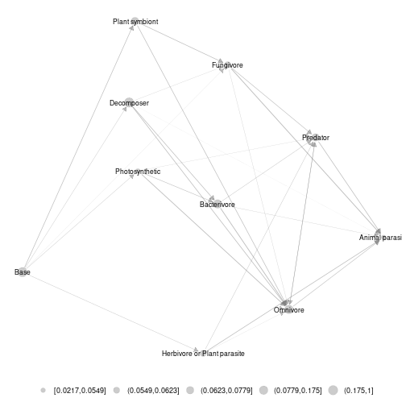

## Norway soil metanetwork data set 

Norway soil metanetwork dataset was extracted from *Calderon-SAnou et al. 2021*. It consists in a soil expert knowledge metaweb
that contains $40$ tropho-functional groups and $204$ interactions. Tropho-functional groups have abundance data built from eDNA data in disturbed and non-disturbed sites by moth outbreaks. This dataset also contains a trophic table that contains broader taxonomic and functional informations on groups.

In this vignette, we aim at represent metaweb at different aggregation levels and compare local networks with layouts provided by 'metanetwork'.

## Loading the dataset


```r
library(metanetwork)
library(igraph)

data("meta_norway")
print(meta_norway)
```

```
## metaweb has 40 nodes and 204 edges 
## 2 local networks 
## available resolutions (not computed) are: trophic_group trophic_class taxa
```

### `plot_trophic_table` function

Trophic table describes nodes memberships in higher relevant groups. In angola dataset, two different taxonomic resolutions are available. Networks can be handled and represented at trophic class or trophic group level.       
The `plot_trophic_table` function allows representing the tree describing species memberships.


```r
ggnet.custom = ggnet.default
ggnet.custom$label.size = 2
plot_trophicTable(meta_norway,res = c('trophic_group','trophic_class'),ggnet.config = ggnet.custom)
```


### `append_agg_nets` method

The method `append_agg_nets` allows computing and appending aggregated networks (at the different available resolutions shown by `plot_trophic_table`) to the current metanetwork.


```r
meta_norway = append_agg_nets(meta_norway)
print(meta_norway)
```

```
## metaweb has 40 nodes and 204 edges 
## 2 local networks 
## available resolutions are: trophic_group trophic_class taxa
```

## Represent the metaweb at several resolutions

### Representing aggregated networks, adding a legend to networks

Once computed, `ggmetanet` function allows representing aggregated networks and legending local networks using trophic table using 'ggnet' visualisation. Do not forget to first compute trophic levels. Computation of 'TL-tsne' layout is done `ggmetanet` function.


```r
meta_norway = compute_TL(meta_norway)
ggmetanet(g = meta_norway$metaweb_trophic_class,beta = 0.2,metanetwork = meta_norway)
```


Node sizes are proportional to relative abundances. Trophic table allows adding a legend to network at the finest resolution.


```r
ggnet.custom = ggnet.default
ggnet.custom$label.size = 2
ggmetanet(g = meta_norway$metaweb,beta = 0.006,legend = 'taxa',metanetwork = meta_norway, ggnet.config = ggnet.custom)
```


### Attaching layout

Since `TL-tsne` layout is stochastic and requires (a bit of) computation times, saving and using the the same layout (for a given $\beta$ value) is recommended. Moreover, it makes easier visual network analysis and comparison since it is fixed.
`attach_layout` function allows saving computed layouts by attaching them as a node attribute.


```r
#attaching 'TL-tsne' layout to the metaweb
meta_norway = attach_layout(metanetwork = meta_norway,beta = 0.006)
ggmetanet(g = meta_norway$metaweb,beta = 0.006,legend = 'taxa',metanetwork = meta_norway, ggnet.config = ggnet.custom)
```


```r
#attaching 'TL-tsne' layout to metaweb at class level
meta_norway = attach_layout(metanetwork = meta_norway,g = meta_norway$metaweb_trophic_class,beta = 0.006)
ggmetanet(g = meta_norway$metaweb_trophic_class,beta = 0.006,metanetwork = meta_norway)
```


### 'group-TL-tnse' layout

A variation of `'TL-tsne'` layout consists in `'group-TL-tsne'` layout. It mixes `'TL-tsne'` and a regular `igraph` layout to provide a representation where species from the same group are clustered together. Such approach provides more stable and interpretable. Morever, it is more efficient in terms of computation time since it only requires `'TL-tsne'` layout computation at the aggregated level instead of computing it in higher dimension at the group level.
`'group-TL-tsne'` layout is stored as node attribute.


```r
meta_norway = attach_layout(meta_norway,beta = 0.2,mode = "group-TL-tsne",res = "trophic_class")
vertex_attr_names(meta_norway$metaweb)
```

```
## [1] "name"                   "ab"                     "TL"                    
## [4] "layout_beta0.006"       "group_layout_x_beta0.2" "group_layout_y_beta0.2"
```

```r
ggmetanet(meta_norway,beta = 0.2,mode = "group-TL-tsne",legend = "trophic_class",ggnet.config = ggnet.custom)
```


## Representing and comparing local networks

`diff_plot` allows comparing local networks. Here, it provides a comparison between high and low disturbed sites by moth outbreaks.


```r
diff_plot(g1 = meta_norway$high,g2 = meta_norway$low,beta = 0.006,metanetwork = meta_norway)
```

```
## mode is TL-tsne
```

```
## plotting: high_trophic_group - low_trophic_group
```

```
## mode is TL-tsne
```

```
## beta = 0.006
```

```
## Epoch: Iteration #100 error is: 1333.49077132459
```

```
## Epoch: Iteration #200 error is: 319.515606511174
```

```
## Epoch: Iteration #300 error is: 319.647881726646
```


Here, a new 'TL-tsne' layout is computed.

### Using metaweb layout

In order to gain reproducibility and not to compute `'TL-tsne'` layout at each call, use argument `layout_metaweb = T` to represent the difference network with metaweb layout.


```r
diff_plot(g1 = meta_norway$high,g2 = meta_norway$low,beta = 0.006,metanetwork = meta_norway,layout_metaweb = T)
```

```
## mode is TL-tsne
```

```
## plotting: high_trophic_group - low_trophic_group
```

```
## mode is TL-tsne
```


### Using `'group-TL-tsne'` layout

Once computed on the metaweb, `'group-TL-tsne'` layout can be used in `'diff_plot'`


```r
ggnet.custom$arrow.size = 2
ggnet.custom$edge.alpha = 0.2

diff_plot(g1 = meta_norway$high,g2 = meta_norway$low,beta = 0.2, mode = "group-TL-tsne",
          metanetwork = meta_norway,layout_metaweb = T,ggnet.config = ggnet.custom)
```

```
## mode is group-TL-tsne
```

```
## plotting: high_trophic_group - low_trophic_group
```

```
## mode is group-TL-tsne
```


