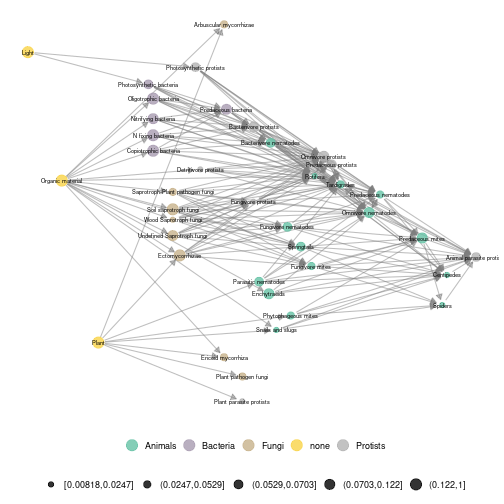
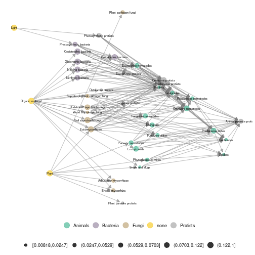
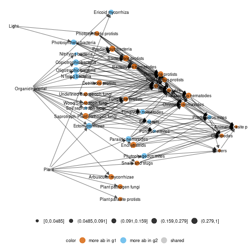
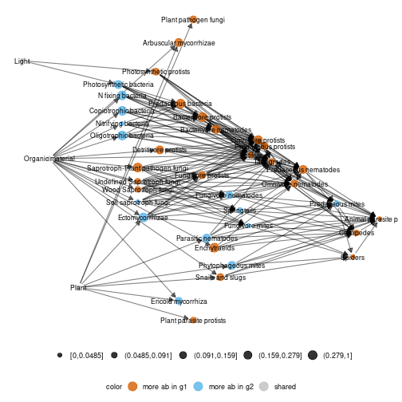

## Norway soil metanetwork data set 

Norway soil metanetwork dataset was extracted from *Calderon-Sanou et al. 2021*. It consists in a soil expert knowledge metaweb
that contains $40$ tropho-functional groups and $204$ interactions. Tropho-functional groups have abundance data built from eDNA data in disturbed and non-disturbed sites by moth outbreaks. This dataset also contains a trophic table that contains broader taxonomic and functional informations on groups.

In this vignette, we aim at represent metaweb at different aggregation levels and compare local networks with layouts provided by 'metanetwork'.

## Loading the dataset


```r
library(metanetwork)
library(igraph)

data("meta_norway")
class(meta_norway)
```

```
## [1] "metanetwork"
```

```r
print(meta_norway)
```

```
## metaweb has 40 nodes and 204 edges 
## 2 local networks 
## available resolutions (not computed) are: trophic_group trophic_class taxa
```

### `plot_trophic_table` function

Trophic table describes nodes memberships in higher relevant groups. In angola dataset, two different taxonomic resolutions are available. Networks can be handled and represented at trophic class or trophic group level.       
The `plot_trophic_table` function allows representing the tree describing species memberships.


```r
ggnet.custom = ggnet.default
ggnet.custom$label.size = 2
plot_trophicTable(meta_norway,res = c('trophic_group','trophic_class'),ggnet.config = ggnet.custom)
```


### `append_agg_nets` method

The method `append_agg_nets` allows computing and appending aggregated networks (at the different available resolutions shown by `plot_trophic_table`) to the current metanetwork.


```r
meta_norway = append_agg_nets(meta_norway)
print(meta_norway)
```

```
## metaweb has 40 nodes and 204 edges 
## 2 local networks 
## available resolutions are: trophic_group trophic_class taxa
```

## Represent the metaweb at several resolutions

### Representing aggregated networks, adding a legend to networks

Once computed, `ggmetanet` function allows representing aggregated networks and legending local networks using trophic table using 'ggnet' visualisation. Do not forget to first compute trophic levels. Computation of 'TL-tsne' layout is done `ggmetanet` function.


```r
meta_norway = compute_TL(meta_norway)
ggmetanet(g = meta_norway$metaweb_trophic_class,beta = 0.2,metanetwork = meta_norway)
```


Node sizes are proportional to relative abundances. Trophic table allows adding a legend to network at the finest resolution.


```r
ggnet.custom = ggnet.default
ggnet.custom$label.size = 2
ggmetanet(g = meta_norway$metaweb,beta = 0.006,legend = 'taxa',metanetwork = meta_norway, ggnet.config = ggnet.custom)
```



The metaweb has two basal resources: plant and organic material. They have the lowest x-axis values in the 'TL-tsne' layout. The channel starting from plants corresponds to the green energy channel while the channel starting from organic materials is the brown channel. Importantly, we observe from our network representation that bacterial and fungal paths are separated in the brown channel. It means that they are linked to separated paths higher up in the network (e.g. bacterivore and fungivore groups)

### Attaching layout

Since `TL-tsne` layout is stochastic and requires (a bit of) computation times, saving and using the the same layout (for a given $\beta$ value) is recommended. Moreover, it makes easier visual network analysis and comparison since it is fixed.
`attach_layout` function allows saving computed layouts by attaching them as a node attribute.


```r
#attaching 'TL-tsne' layout to the metaweb
meta_norway = attach_layout(metanetwork = meta_norway,beta = 0.006)
#TL-tsne layout is stored as node attribute
igraph::vertex_attr_names(meta_norway$metaweb)
```

```
## [1] "name"             "ab"               "TL"               "layout_beta0.006"
```

```r
#get the layout
V(meta_norway$metaweb)$layout_beta0.006
```

```
##  [1] -12.9475056  -8.0027108 -16.2079443 -22.7132091 -11.3462398 -20.1130143  -6.5106735   9.9233144  -4.5854150  -2.0651410 -14.1010060   1.0591155
## [13]   4.2481564 -18.2430818   2.8069118  22.6621553  12.6249591   5.3913804   6.2461442  -0.2074156   7.6423898  -9.8195071 -32.2030752  14.0077834
## [25]  17.4103375  11.2056083   8.5513003  19.8232874  15.6005706  29.1014202  -9.5435798 -27.9502300   1.4803516  34.2080994  -6.0977349  -1.5314268
## [37]  -3.3362833 -25.0019387   3.4444592  25.0893880
```

```r
#Represent the metaweb with the computed layout
ggmetanet(g = meta_norway$metaweb,beta = 0.006,legend = 'taxa',metanetwork = meta_norway, ggnet.config = ggnet.custom)
```


Using `attach_layout`, you can compute several layouts for the same $\beta$ value.


```r
# attaching a new 'TL-tsne' layout to the metaweb
meta_norway = attach_layout(metanetwork = meta_norway,beta = 0.006)
# the new TL-tsne layout is stored as node attribute
igraph::vertex_attr_names(meta_norway$metaweb)
```

```
## [1] "name"               "ab"                 "TL"                 "layout_beta0.006"   "layout_beta0.006_1"
```

```r
# get the new layout
V(meta_norway$metaweb)$layout_beta0.006_1
```

```
##  [1] -11.3292919  -6.2404344 -14.4904523 -20.7829565  -9.7811898 -18.2751020  -8.2376113  14.2437126  -3.1185555  -0.5114248 -12.4205135   2.8892467
## [13]   6.7630146 -16.4638242   4.8245507  24.6439560  11.5016087   5.8200419   7.9570338   1.3369044   9.2702139  -4.9686021 -33.2063100  19.0852838
## [25]  12.8683306  10.0729920  15.5970396  21.5980855  17.2236436 -25.4482627  -7.7653373 -28.8226861   3.7008810  32.6364900  -4.5686339  -0.1325995
## [37]  -1.8834867 -22.9474544   2.0567619  27.3049378
```

```r
#Represent the metaweb with the computed layout
ggmetanet(g = meta_norway$metaweb,beta = 0.006,legend = 'taxa',metanetwork = meta_norway, ggnet.config = ggnet.custom,nrep_ly = 2)
```



We see that even if the two layouts for the same $\beta$ value are different, they share some structural characteristics. For example, fungal and bacterial groups are clustered together and are linked to their corresponding consumers (fungivore and bacterivore).


```r
#attaching 'TL-tsne' layout to metaweb at class level
meta_norway = attach_layout(metanetwork = meta_norway,g = meta_norway$metaweb_trophic_class,beta = 0.006)
ggmetanet(g = meta_norway$metaweb_trophic_class,beta = 0.006,metanetwork = meta_norway)
```


### 'group-TL-tnse' layout

A variation of `'TL-tsne'` layout consists in `'group-TL-tsne'` layout. It mixes `'TL-tsne'` and a regular `igraph` layout to provide a representation where species from the same group are clustered together. Such approach provides more stable and interpretable. Morever, it is more efficient in terms of computation time since it only requires `'TL-tsne'` layout computation at the aggregated level instead of computing it in higher dimension at the group level.
`'group-TL-tsne'` layout is stored as node attribute.


```r
meta_norway = attach_layout(meta_norway,beta = 0.2,mode = "group-TL-tsne",res = "trophic_class")
vertex_attr_names(meta_norway$metaweb)
```

```
## [1] "name"                   "ab"                     "TL"                     "layout_beta0.006"       "layout_beta0.006_1"     "group_layout_x_beta0.2"
## [7] "group_layout_y_beta0.2"
```

```r
ggmetanet(meta_norway,beta = 0.2,mode = "group-TL-tsne",legend = "trophic_class",ggnet.config = ggnet.custom)
```


## Representing and comparing local networks

`diff_plot` allows comparing local networks. Here, it provides a comparison between high and low disturbed sites by moth outbreaks.


```r
diff_plot(g1 = meta_norway$high,g2 = meta_norway$low,beta = 0.006,metanetwork = meta_norway)
```

```
## mode is TL-tsne
```

```
## plotting: high_trophic_group - low_trophic_group
```

```
## mode is TL-tsne
```

```
## beta = 0.006
```

```
## Epoch: Iteration #100 error is: 1333.49922010638
```

```
## Epoch: Iteration #200 error is: 319.518122109745
```

```
## Epoch: Iteration #300 error is: 319.65237149482
```



It highlights a shift from Ectomycorrhizae and Ericoid mycorrhizae towards Arbuscular mycorrhizae due to increase of shrubs after the perturbation and also an increase in soil predator abundances. Here, a new 'TL-tsne' layout is computed.

### Using metaweb layout

In order to gain reproducibility and not to compute `'TL-tsne'` layout at each call, use argument `layout_metaweb = T` to represent the difference network with metaweb layout.


```r
diff_plot(g1 = meta_norway$high,g2 = meta_norway$low,beta = 0.006,metanetwork = meta_norway,layout_metaweb = T)
```

```
## mode is TL-tsne
```

```
## plotting: high_trophic_group - low_trophic_group
```

```
## mode is TL-tsne
```



### Using `'group-TL-tsne'` layout

Once computed on the metaweb, `'group-TL-tsne'` layout can be used in `'diff_plot'`


```r
ggnet.custom$arrow.size = 2
ggnet.custom$edge.alpha = 0.2

diff_plot(g1 = meta_norway$high,g2 = meta_norway$low,beta = 0.2, mode = "group-TL-tsne",
          metanetwork = meta_norway,layout_metaweb = T,ggnet.config = ggnet.custom)
```

```
## mode is group-TL-tsne
```

```
## plotting: high_trophic_group - low_trophic_group
```

```
## mode is group-TL-tsne
```


## Computing network indices and metrics

Besides network representation, 'metanetwork' package can compute usual network metrics (weighted connectance, mean and max trophic level, mean shortest path length). Network diversity and dissimilarity indices based on Hill numbers are also implemented in order to quantitatively compare local networks at the different resolutions.


```r
metrics_norway = compute_metrics(meta_norway)
```

```
## Error in t(igraph::V(g)$ab) %*% adj: arguments inadéquats
```

```r
#metrics at the different resolutions
metrics_norway$trophic_group
```

```
## Error in eval(expr, envir, enclos): objet 'metrics_norway' introuvable
```

```r
metrics_norway$trophic_class
```

```
## Error in eval(expr, envir, enclos): objet 'metrics_norway' introuvable
```

```r
metrics_norway$taxa
```

```
## Error in eval(expr, envir, enclos): objet 'metrics_norway' introuvable
```

We now compute network diversity indices based on Hill numbers (cf. Ohlmann et al. 2019). The indices are based on node and link abundances are can be partitioned in $\alpha$-diversity, $\beta$-diversity and $\gamma$-diversity. A viewpoint parameter $q$ allows giving more weight (see `compute_div` documentation)


```r
div_norway = compute_div(meta_norway)

div_norway$nodes
```

```
##              trophic_group trophic_class     taxa
## Gamma_P          17.166819      4.637323 3.865180
## mean_Alpha_P     16.645513      4.600212 3.847461
## Beta_P            1.031318      1.008067 1.004605
## Alpha_high_P     17.833549      4.650241 3.924770
## Alpha_low_P      15.536622      4.550721 3.771674
```

```r
div_norway$links
```

```
##              trophic_group trophic_class     taxa
## Gamma_L          52.899140      8.044432 9.227551
## mean_Alpha_L     48.298149      7.918602 9.093270
## Beta_L            1.095262      1.015890 1.014767
## Alpha_high_L     63.542723      8.410311 9.868439
## Alpha_low_L      36.710910      7.455640 8.378992
```


As reported in Calderon-Sanou et al. 2021, we see higher node and link diversities in sites with a high perturbation level. This is due to the fact that dominant groups tend to to disappear, giving way to an increase in predator groups and leading so to more evenly distributed abundances.
Pairwise dissimilarity indices (both on nodes and links) are also implemented in metanetwork  (see `compute_dis` documentation).


```r
dis_norway = compute_dis(meta_norway)

#nodes and links dissimilarity at Species resolution
dis_norway$trophic_group$nodes
```

```
##            high        low
## high 0.00000000 0.04448943
## low  0.04448943 0.00000000
```

```r
dis_norway$trophic_group$links
```

```
##           high       low
## high 0.0000000 0.1312764
## low  0.1312764 0.0000000
```

```r
#nodes and links dissimilarity at Phylum resolution
dis_norway$trophic_class$nodes
```

```
##            high        low
## high 0.00000000 0.01159194
## low  0.01159194 0.00000000
```

```r
dis_norway$trophic_class$links
```

```
##            high        low
## high 0.00000000 0.02274482
## low  0.02274482 0.00000000
```

```r
#compute dissimilarity at taxa resolution only
compute_dis(meta_norway,res = "taxa")
```

```
## $taxa
## $taxa$nodes
##             high         low
## high 0.000000000 0.006628866
## low  0.006628866 0.000000000
## 
## $taxa$links
##            high        low
## high 0.00000000 0.02114852
## low  0.02114852 0.00000000
```

We see that networks are more dissimilar at trophic_group compared to trophic_class resolution both on nodes and links. Moreover, at both resolutions, network are more dissimilar regarding link abundances compared to node abundances.
To gain in efficiency, `compute_dis` is uses parallel computation (see `ncores` argument in `compute_dis` documentation)

## References

- Calderón-Sanou, I., Münkemüller, T., Zinger, L., Schimann, H., Yoccoz, N. G., Gielly, L., ... & Thuiller, W. (2021). Cascading effects of moth outbreaks on subarctic soil food webs. Scientific Reports, 11(1), 15054.

- Ohlmann, M., Miele, V., Dray, S., Chalmandrier, L., O'connor, L., & Thuiller, W. (2019). Diversity indices for ecological networks: a unifying framework using Hill numbers. Ecology letters, 22(4), 737-747.
