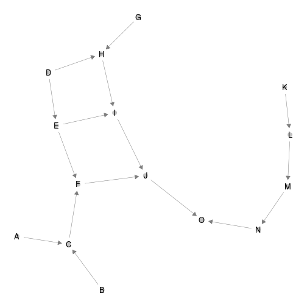
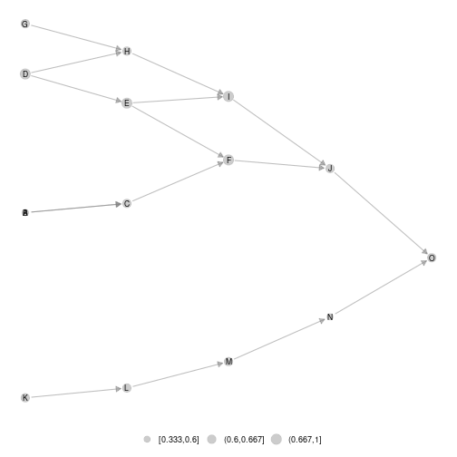
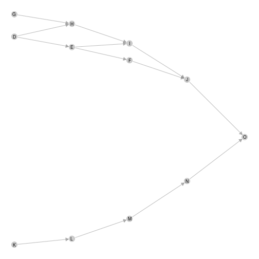
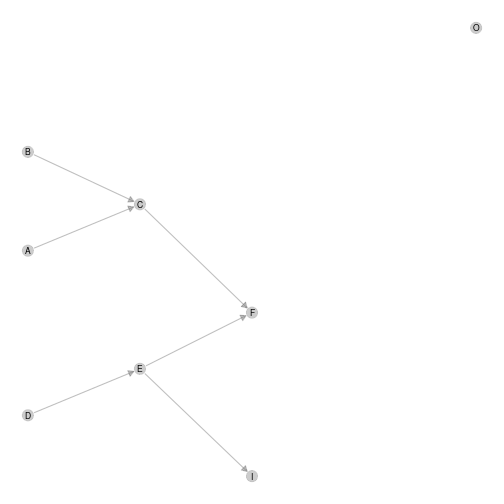
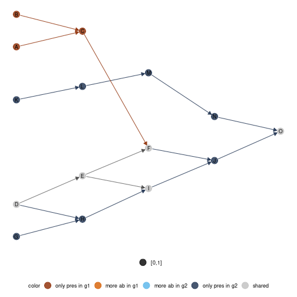
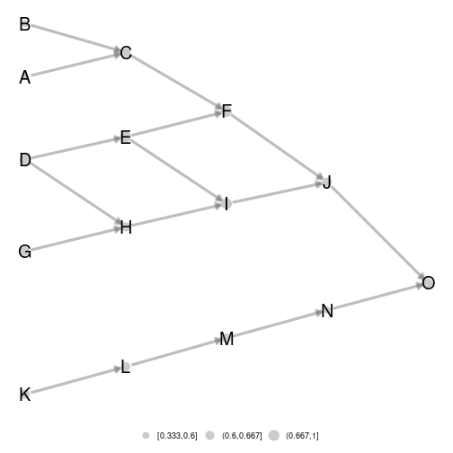
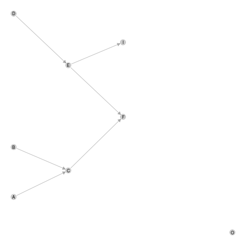
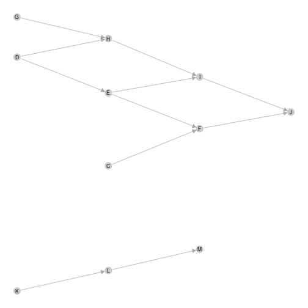
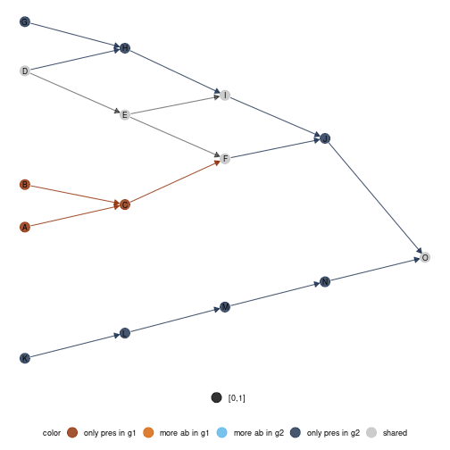

## Preliminaries

This vignette illustrates 'metanetwork' through a pyramid network example.
The packages required to run the vignette are the following:


```r
library(igraph)
library(metanetwork)
```

## Generating pyramid data set

### Generating the metaweb an representing it using 'ggnet2'
We first generate a pyramid network using 'igraph' and represent it using 'ggnet2'


```r
library(igraph)
library(network)
library(intergraph)
library(GGally)

n = 5
#generate a lattice 
g = igraph::make_lattice(dim = 2,length = n,directed = T)
#deleting nodes and edges
nodes_to_rm = c()
for (k in 1:(n-1)){
  nodes_to_rm = c(nodes_to_rm,((k-1)*n+1):(k*n - k))
}
g = delete_vertices(g,nodes_to_rm)
g = delete_edges(g,c("7|12","8|13","9|14","2|5"))
V(g)$name = LETTERS[1:vcount(g)]
#representing the lattice using ggnet package
network = asNetwork(g)
ggnet2(network, arrow.size = 7,size = 3 ,arrow.gap = 0.025, label = T)
```


Notice that 'ggnet2' default layout algorithm (Fruchterman-Reingold algorithm, a force directed algorithm) is non-reproducible. Moreover, x-axis and y-axis do not have any ecological interpretation.


```r
ggnet2(network, arrow.size = 7,size = 3 ,arrow.gap = 0.025, label = T)
```



### Generating abundance table
We now generate three local communities (presence/absence in our case)

```r
#sampling a presence table
presence = rbind(c(1,1,1,1,1,1,0,0,1,0,0,0,0,0,1),
                 c(0,0,0,1,1,1,1,1,1,1,1,1,1,1,1),
                 c(0,0,1,1,1,1,1,1,1,1,1,1,1,0,0))

rownames(presence) = c('a','b','c')
colnames(presence) = V(g)$name
```

## Building a metanetwork object
From the lattice metaweb and abundance table, build a S3 object of class 'metanetwork' using `build_metanetwork`


```r
#building metanetwork object
meta0 = build_metanet(metaweb = g,abTable = presence)
class(g)
```

```
## [1] "igraph"
```

```r
class(meta0)
```

```
## [1] "metanetwork"
```

method `print` prints a summary of the considered metanetwork.


```r
print(meta0)
```

```
## metaweb has 15 nodes and 16 edges 
## 3 local networks 
## single resolution available
```

## Handling metanetworks

### the class 'metanetwork'
A 'metanetwork' object consists in a list of 'igraph' objects:

* metaweb, the metaweb used to build the metanetwork, an 'igraph' object with node attribute `$ab` indicating the local relative abundance of each node and graph attribute `$name`indicating `"metaweb"`
* local networks, a list of 'igraph' objects with node attribute `$ab` indicating the local relative abundance of each node in each network and graph attribute `$name` indicating local network names, that is rownames of the abundance table.


```r
meta0$b$name
```

```
## [1] "b"
```

```r
meta0$metaweb$name
```

```
## [1] "metaweb"
```

```r
#abundances
table(V(meta0$b)$ab)
```

```
## 
## 0.0833333333333333 
##                 12
```

```r
table(V(meta0$metaweb)$ab)
```

```
## 
##  0.032258064516129 0.0645161290322581 0.0967741935483871 
##                  3                  8                  4
```

Metaweb node relative abundances are the mean of the local relative abundances.
Additional objects like `abTable` or `trophicTable` can be included in a 'metanetwork' object

### Computing trophic levels

'metanetwork' package enables 2D network representation with x-axis equals to trophic levels. To compute trophic levels, 'metanetwork' implements the method, based on Laplacian matrix, described in MacKay et al. 2020.     
The metaweb needs to be connected for trophic levels to be unique. Local networks can however be disconnected (see Ref).
A method `compute_TL` allows computing trophic levels and storing it as node attribute `$TL` of each network.


```r
#compute trophic levels for metaweb and local networks
meta0 = compute_TL(meta0)
V(meta0$metaweb)$name
```

```
##  [1] "A" "B" "C" "D" "E" "F" "G" "H" "I" "J" "K" "L" "M" "N" "O"
```

```r
V(meta0$metaweb)$TL
```

```
##  [1] 0.000000e+00 0.000000e+00 1.000000e+00 4.440892e-16 1.000000e+00 2.000000e+00 4.440892e-16 1.000000e+00 2.000000e+00 3.000000e+00
## [11] 0.000000e+00 1.000000e+00 2.000000e+00 3.000000e+00 4.000000e+00
```

## Representing metanetworks

'metanetwork' implements a layout algorithm, 'TL-tsne', specifically designed for trophic networks, based on trophic levels and on dimension reduction of graph diffusion kernel.

### Diffusion graph kernel

Diffusion kernel is a similarity matrix between nodes according to a diffusion process. Let $G$ be a directed network, $\mathbf{A}$ its adjacency matrix and $\mathbf{D}$ its degree diagonal matrix. The laplacian matrix of $G$ is defined as:

\begin{equation}
\mathbf{L} = \mathbf{D} - \mathbf{A} - \mathbf{A}^{T}
\end{equation}

The diffusion kernel is then defined as (Kondor & Lafferty, 2002):

\begin{equation}
    \textbf{K} = \exp(-\beta\mathbf{L}) = \sum_{k \geq 0} \frac{(- \beta\mathbf{L})^k}{k!}
\end{equation}

with $\beta$ a positive parameter.
Diffusion kernel measures similarity between pairs of nodes by taking into account paths of arbitrary length. It does not restrict to direct neighbors.

### beta parameter

$\beta$ is the single parameter of the diffusion kernel. It controls the weight given to the different paths in the diffusion kernel. It is also analogous to the diffusion constant in physics. We'll see through examples its importance in squeezing networks.

### `ggmetanet` function

The main metanetwork representation function is `ggmetanet`. It allows representing metaweb and local networks using `ggnet` and both layout algorithms. `ggmetanet` plots the metaweb of the current metanetwork by default.


```r
#ggmetanet#
ggmetanet(metanetwork = meta0,beta = 0.1)
```


       


```r
#ggmetanet#
ggmetanet(metanetwork = meta0,beta = 0.45)
```


   
`ggmetanet` can also represent local networks (with specific layout)
     

```r
ggmetanet(g = meta0$b,beta = 0.1,metanetwork = meta0)
```


Increasing `beta` squeeze y-axis

```r
ggmetanet(g = meta0$b,beta = 1,metanetwork = meta0)
```


      
Moreover, it clusters nodes belonging to different 'branches'. They become more and more similar when beta is increased.        

*Representing disconnected networks*

If the metaweb needs to be connected, local networks can be disconnected due to sampling effects. In that case, trophic levels are computed using metaweb trophic levels. The basal species of each connected component has a trophic level equals to its value in the metaweb.        


```r
ggmetanet(g = meta0$a,beta = 0.45,metanetwork = meta0)
```


    
### `diff_plot` function

In order to compare local networks, a `diff_plot` function is implemented. It colors nodes according to their presence/absence or variation in abundance in both networks.


```r
diff_plot(g1 = meta0$a,g2 = meta0$b,beta = 0.1,mode = 'TL-tsne',metanetwork = meta0)
```


   
### Changing `ggnet` configuration parameters 

In order to fine tune network plots, it is possible to modify `ggnet` parameters in  metanetwork. An object `ggnet.default` is stored and wraps the different visualisation parameters. Change it to modify the plot.


```r
ggnet.custom = ggnet.default
ggnet.custom$edge.size = 3*ggnet.default$edge.size
ggnet.custom$label.size = 7
ggmetanet(beta = 0.1,metanetwork = meta0,
          ggnet.config = ggnet.custom)
```



### Attaching layout  

For network representation reproducibility and to gain computation time, we recommend to store 'TL-tsne' layout after computation. To do so, use the method `attach_layout`. Once the layout computed, it is attached to the network as node attribute.


```r
#for the metaweb
meta0 = attach_layout(meta0,beta = 0.1)
V(meta0$metaweb)$layout_beta0.1
```

```
##  [1] -10.5245709   0.5715783  -4.6297208  30.2718230  18.7743114   7.3023306  43.1058371  36.1900901  23.8856698  12.6402267 -44.7744167
## [12] -38.1999701 -31.4062122 -24.7935220 -18.4134542
```

```r
#for a local network
meta0 = attach_layout(metanetwork = meta0,g = meta0$a,beta = 0.1)
V(meta0$metaweb)$layout_beta0.1
```

```
##  [1] -10.5245709   0.5715783  -4.6297208  30.2718230  18.7743114   7.3023306  43.1058371  36.1900901  23.8856698  12.6402267 -44.7744167
## [12] -38.1999701 -31.4062122 -24.7935220 -18.4134542
```

Then, any call of `ggmetanet` or `vismetaNetwork` will use the computed layout for the desired $\beta$ value.


```r
ggmetanet(meta0,beta = 0.1)
```


Using that way, network representation is reproducible.


```r
#calling again ggmetanet
ggmetanet(meta0,beta = 0.1)
```


Once the layout computed for the metaweb, it can be used to represent local network or difference network using `layout_metaweb = T`


```r
#ggmetanet
ggmetanet(meta0,beta = 0.1,layout_metaweb = T)
```


```r
ggmetanet(g = meta0$a,metanetwork = meta0,beta = 0.1,layout_metaweb = T)
```



```r
ggmetanet(g = meta0$b,metanetwork = meta0,beta = 0.1,layout_metaweb = T)
```


```r
ggmetanet(g = meta0$c,metanetwork = meta0,beta = 0.1,layout_metaweb = T)
```



```r
#diffplot
diff_plot(meta0,meta0$a,meta0$b,beta = 0.1,layout_metaweb = T)
```



## Computing network indices and metrics

Besides network representation, 'metanetwork' package can compute usual network metrics (weighted connectance, mean and max trophic level, mean shortest path length). Network diveristy and dissimilarity indices based on Hill numbers are also implemented in order to quantitatively compare local networks.


```r
  #computing network metrics
  compute_metrics(meta0)
```

```
##         connectance  mean_TL max_TL mean_shortest_path_length
## metaweb  0.08428720 1.333333      4                  2.069767
## a        0.09375000 1.250000      4                  1.400000
## b        0.09027778 1.583333      4                  1.968750
## c        0.09090909 1.181818      3                  1.550000
```
The metaweb is less connected than local networks but have the highest mean shortest path length.
We now compute network diversity indices based on Hill numbers (cf. Ohlmann et al. 2019). The indices are based on node and link abundances are can be partitionned in $\alpha$-diversity, $\beta$-diversity and $\gamma$-diversity. A viewpoint parameter $q$ allows giving more weight (see `compute_div` documentation)


```r
#computing diversities
compute_div(meta0)
```

```
## $nodes
## $nodes$Gamma
## [1] 14.1607
## 
## $nodes$mean_Alpha
## [1] 10.18329
## 
## $nodes$Beta
## [1] 1.390582
## 
## $nodes$Alphas
##  a  b  c 
##  8 12 11 
## 
## 
## $links
## $links$Gamma
## [1] 14.53731
## 
## $links$mean_Alpha
## [1] 9.502308
## 
## $links$Beta
## [1] 1.529872
## 
## $links$Alphas
##  a  b  c 
##  6 13 11
```

Moreover, pairwise dissimilarity indices (both on nodes and links) are also implemented in metanetwork  (see `compute_dis` documentation).


```r
#computing pairwise dissimilarities
compute_dis(meta0)
```

```
## $nodes
##           a         b         c
## a 0.0000000 0.4942966 0.4699751
## b 0.4942966 0.0000000 0.1299762
## c 0.4699751 0.1299762 0.0000000
## 
## $links
##           a         b         c
## a 0.0000000 0.6712475 0.5174744
## b 0.6712475 0.0000000 0.1650477
## c 0.5174744 0.1650477 0.0000000
```

In this case, we see that links dissimilarities are higher than node dissimilarities. Indeed, absent nodes from the metaweb might lead to the absence of several edges.

## References

- Kondor, R. I., & Lafferty, J. (2002, July). Diffusion kernels on graphs and other discrete structures. In Proceedings of the 19th international conference on machine learning (Vol. 2002, pp. 315-322).

- MacKay, R. S., S. Johnson, and B. Sansom. "How directed is a directed network?." Royal Society open science 7.9 (2020): 201138

- Ohlmann, M., Miele, V., Dray, S., Chalmandrier, L., O'connor, L., & Thuiller, W. (2019). Diversity indices for ecological networks: a unifying framework using Hill numbers. Ecology letters, 22(4), 737-747.

