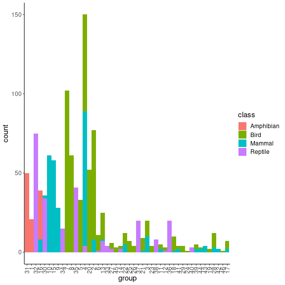
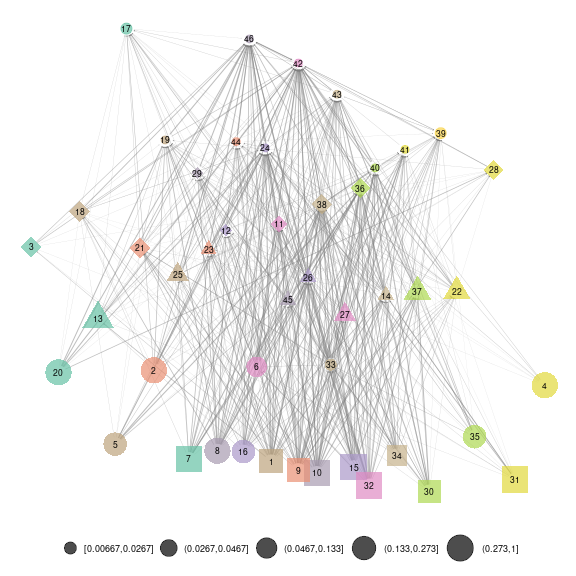
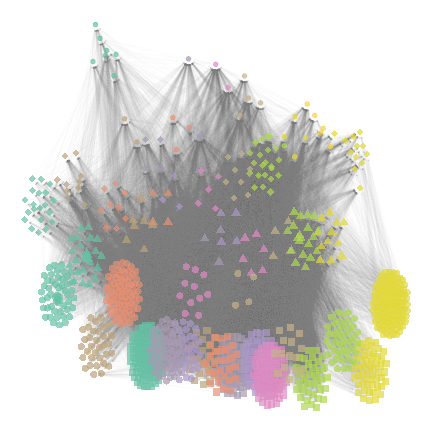

## The European vertebrates data set

Metaweb of potential interactions between European terrestrial vertebrates. This data set is extracted from *Maiorano et al. 2020* and *O'Connor et al. 2020*. It contains $1122$ vertebrate species (birds, mammals, amphibians and reptiles) and $49883$ expert-knowledge potential interactions. O'Connor et al. 2020 applied a Stochastic Block Model (SBM), a method that group together nodes with similar edge probability pattern (see *Daudin et al. 2008*). This method inferred $46$ species groups. We also have classification of species in $4$ classes (Amphibians, Birds, Mammals and Reptiles).

In this vignette, we aim at representing this large network using SBM groups.

## Loading the data set


```r
library(metanetwork)
library(igraph)
library(ggplot2)
library(ggimage)
```


```r
data("meta_vrtb")
print(meta_vrtb)
```

```
## metaweb has 1122 nodes and 49865 edges 
## single network 
## available resolutions are: sp group Class
```

### Append aggregated networks

To compute aggregated networks at the SBM group level and Class level, we use the `append_agg_nets` method.


```r
meta_vrtb = append_agg_nets(meta_vrtb)
```

### Compute trophic levels

In order to represent this metaweb, we compute trophic levels since it is the first axis of 'metanetwork' layout.


```r
meta_vrtb = compute_TL(meta_vrtb)
```

We represent the distribution of trophic levels of the $4$ classes and $46$ SBM groups.


```r
TL_df = cbind(name = V(meta_vrtb$metaweb)$name,
              TL = V(meta_vrtb$metaweb)$TL,
              group = meta_vrtb$trophicTable[V(meta_vrtb$metaweb),"group"],
              class = meta_vrtb$trophicTable[V(meta_vrtb$metaweb),"Class"]) %>%
        as.data.frame()

TL_df$TL = as.numeric(TL_df$TL)

#boxplot of trophic levels through Classes
ggplot(TL_df, aes(x=class, y=TL)) +
  geom_boxplot() + theme_classic()
```


```r
#boxplot of trophic levels through SBM groups
ggplot(TL_df, aes(x=reorder(group, TL), y=TL)) +
  geom_boxplot() + theme_classic() + xlab("group") +
  theme(axis.text.x = element_text(angle = 90, vjust = 0.5, hjust=1),
        text = element_text(size = 15))
```


We see that the four classes contain species of various trophic levels. SBM groups are more ordered in terms of trophic level, even if several trophic groups have similar trophic levels. It is a finer scale than the class level. 
We then represent the group composition in terms of classes.


```r
TL_df_mean = TL_df %>% 
  dplyr::group_by(group) %>%
  dplyr::summarise(dplyr::across(TL, mean, na.rm = TRUE)) %>%
  as.data.frame()

rownames(TL_df_mean) = TL_df_mean$group

TL_df_agg = TL_df %>% dplyr::count(group,class) %>%
            dplyr::mutate(TL = TL_df_mean[group,2])

ggplot(TL_df_agg, aes(fill=class, y=n, x=reorder(group, TL))) + 
  geom_bar(position="stack", stat="identity") + theme_classic() + xlab("group") +
  theme(axis.text.x = element_text(angle = 90, vjust = 0.5, hjust=1),
        text = element_text(size = 15)) +
  ylab("count")
```


We see that groups are getting smaller when their mean trophic level increases. Moreover, SMB groups are relatively well separated trough classes.


```r
#this group contains several eagles species
which(meta_vrtb$trophicTable[,"group"] == 17) %>% names()
```

```
## [1] "Accipiter_gentilis"   "Aquila_adalberti"     "Aquila_clanga"        "Aquila_heliaca"       "Hieraaetus_fasciatus" "Lynx_lynx"           
## [7] "Hyaena_hyaena"
```

```r
#single group made of eagle-owl only
which(meta_vrtb$trophicTable[,"group"] == 46) %>% names()
```

```
## [1] "Bubo_bubo"
```

```r
#this one contain wolf and fox
which(meta_vrtb$trophicTable[,"group"] == 42) %>% names()
```

```
## [1] "Canis_lupus"   "Vulpes_vulpes"
```


## Represent the metaweb

In order to represent this large metaweb, we first represent the network at the SBM group level. We will use then the layout at the SBM level to compute the layout at the species level. This layout is called `group-TL-tsne`, as `TL-tsne` is the diffusion based layout of `metanetwork`.

### Representation at the SBM level

Using `ggmetanet` and the precomputed layout for `beta = 0.005`, we first represent the web at the SBM group level


```r
beta = 0.005

#custom ggnet parameters
ggnet.custom = ggnet.default
ggnet.custom$label = T
ggnet.custom$edge.alpha = 0.5
ggnet.custom$alpha = 0.7
ggnet.custom$arrow.size = 1
ggnet.custom$max_size = 12

net_groups = ggmetanet(meta_vrtb,g = meta_vrtb$metaweb_group,flip_coords = T,
          beta = beta,legend = "group",
          ggnet.config = ggnet.custom,edge_thrs = 0.1)
net_groups
```


To compute layout for another $\beta$ value, you can do:

```r
beta = 0.0035

meta_vrtb = attach_layout(meta_vrtb,meta_vrtb$metaweb_group, beta = beta)
#custom ggnet parameters
ggnet.custom = ggnet.default
ggnet.custom$label = T
ggnet.custom$edge.alpha = 0.5
ggnet.custom$alpha = 0.7
ggnet.custom$arrow.size = 1
ggnet.custom$max_size = 12

net_groups2 = ggmetanet(meta_vrtb,g = meta_vrtb$metaweb_group,flip_coords = T,
          beta = beta,legend = "group",
          ggnet.config = ggnet.custom,edge_thrs = 0.1)
net_groups2
```



The `attach_layout` method allows storing computed layout as node attribute


```r
#get computed layout names on metaweb_group
vertex_attr_names(meta_vrtb$metaweb_group)
```

```
## [1] "name"              "ab"                "TL"                "layout_beta0.008"  "layout_beta0.004"  "layout_beta0.005"  "layout_beta0.0035"
```

### `'group-TL-tsne'` layout

To represent the metaweb at the species level, we do not compute 'TL-tsne' at the species level. Instead, we mix the layout computed at SBM level and a regular `igraph` layout to provide a representation where species from the same group are clustered together. Such approach provides more stable and interpretable. Morever, it is more efficient in terms of computation time since it only requires `'TL-tsne'` layout computation at the SBM level instead of computing it in higher dimension at the species level.

We call this layout `'group-TL-tsne'`.


```r
beta = 0.005
ggnet.custom = ggnet.default
ggnet.custom$label = F
ggnet.custom$edge.alpha = 0.02
ggnet.custom$alpha = 0.7
ggnet.custom$arrow.size = 1
ggnet.custom$max_size = 3
ggnet.custom$palette = "Set2"
#add images in the legend (if NULL, legend will represent group names only)
ggnet.custom$img_PATH = "silouhette_metaweb_europe"

net_group_layout = ggmetanet(meta_vrtb,flip_coords = T,mode = "group-TL-tsne",
                              beta = beta,legend = "group",ggnet.config = ggnet.custom)
```


```r
net_group_layout
```


Since the number of groups is large ($46$), `metanetwork` builds a legend containing shapes and colors. $4$ different shape types are ordered along the trophic level axis. By doing so, basal species groups have the same shapes (squares and big circles here). Colors are ordered along the second axis.
Moreover, we use 'phylopic' silhouettes to illustrate each group. We choose a representative species for each group (see `vignettes/silouhette_metaweb_europe` folder for silhouettes and phylopic credits) and `metanetwork` builds the legend using `ggimage` package.


```r
beta = 0.0035
#attaching `group-TL-tsne` for beta = 0.0035, must provide resolution for the groups
meta_vrtb = attach_layout(meta_vrtb,meta_vrtb$metaweb,beta,
                          mode = "group-TL-tsne",res = "group")
#representing it
net_group_layout2 = ggmetanet(meta_vrtb,flip_coords = T,mode = "group-TL-tsne",
                              beta = beta,legend = "group",ggnet.config = ggnet.custom)
```


```r
net_group_layout2
```



The legend is different from the previous plot due to stochasticity of `'TL-tsne` layout. However, since trophic level is fixed, shapes remain the same.

### `'TL-tsne'` layout

We represent here the web at species level using `'TL-tsne'` layout. We do not recommend to use this layout for large networks since it is hard to interpret, unstable and costly in terms of computation time.


```r
beta = 4e-06

#remove legend plot
ggnet.custom$legend.big.nets = F
ggnet.custom$img_PATH = NULL

ggmetanet(meta_vrtb,beta = beta,legend = "group", mode = 'TL-tsne',
          ggnet.config = ggnet.custom,flip_coords = T)
```


It highlights the fact that basal species groups are not well separated on the `TL-tsne` axis. 

## Playing with representation parameters 

### `group-TL-tsne` configuration

If the mean position of groups in `'group-TL-tsne'` layout is fixed, a configuration object allows controlling for height and width of the groups in the same way than `ggnet.config`.


```r
beta = 0.0035

# group-layout config
group_layout.custom = group_layout.default
group_layout.custom$nbreaks_group = 3
group_layout.custom$group_height = c(7,4,2)
group_layout.custom$group_width = c(7,4,2)

#attaching `group-TL-tsne` for beta = 0.0035, must provide resolution for the groups
meta_vrtb = attach_layout(meta_vrtb,meta_vrtb$metaweb,beta,
                          mode = "group-TL-tsne",res = "group",
                          group_layout.config = group_layout.custom)
#representing it
net_group_layout3 = ggmetanet(meta_vrtb,flip_coords = T,mode = "group-TL-tsne",
                              beta = beta,legend = "group",ggnet.config = ggnet.custom)
net_group_layout3
```


### Playing on transparency

In order to represent sub-networks, we advise to play on transparency (alpha). We represent here the metaweb of mammals.


```r
beta = 0.005
mammals_names = names(which(meta_vrtb$trophicTable[,"Class"] == "Mammal"))
ggnet.custom$label = F
ggnet.custom$label.size = 2
net_mammals = ggmetanet(meta_vrtb,flip_coords = T,mode = "group-TL-tsne",
                              beta = beta,legend = "group",ggnet.config = ggnet.custom,
                                alpha_per_node = list(nodes = mammals_names,
                                                      alpha_focal = 0.7,
                                                      alpha_hidden = 0.1)) +
              ggtitle("Mammals")
net_mammals
```


Similarly, we represent the metaweb of birds, amphibians and reptiles (with the same layout) and represent them on the same plot


```r
bird_names = names(which(meta_vrtb$trophicTable[,"Class"] == "Bird"))


net_birds = ggmetanet(meta_vrtb,flip_coords = T,mode = "group-TL-tsne",
                              beta = beta,legend = "group",ggnet.config = ggnet.custom,
                                alpha_per_node = list(nodes = bird_names,
                                                      alpha_focal = 0.7,
                                                      alpha_hidden = 0.1)) + 
              ggtitle("Birds")
```


```r
amphibian_names = names(which(meta_vrtb$trophicTable[,"Class"] == "Amphibian"))


net_amphibians = ggmetanet(meta_vrtb,flip_coords = T,mode = "group-TL-tsne",
                              beta = beta,legend = "group",ggnet.config = ggnet.custom,
                                alpha_per_node = list(nodes = amphibian_names,
                                                      alpha_focal = 0.7,
                                                      alpha_hidden = 0.1)) +
              ggtitle("Amphibians")
```


```r
reptile_names = names(which(meta_vrtb$trophicTable[,"Class"] == "Reptile"))


net_reptiles = ggmetanet(meta_vrtb,flip_coords = T,mode = "group-TL-tsne",
                              beta = beta,legend = "group",ggnet.config = ggnet.custom,
                                alpha_per_node = list(nodes = reptile_names,
                                                      alpha_focal = 0.7,
                                                      alpha_hidden = 0.1)) +
              ggtitle("Reptiles")
```


```r
nets_all = gridExtra::grid.arrange(net_mammals,net_birds,
                                   net_amphibians,net_reptiles,nrow = 2)
```


## References

Daudin, J. J., Picard, F., & Robin, S. (2008). A mixture model for random graphs. Statistics and computing, 18(2), 173-183.

Maiorano, L., Montemaggiori, A., Ficetola, G. F., O’connor, L., & Thuiller, W. (2020). 
TETRA‐EU 1.0: a species‐level trophic metaweb of European tetrapods. Global Ecology and Biogeography, 29(9), 1452-1457.

O’Connor, L. M., Pollock, L. J., Braga, J., Ficetola, G. F., Maiorano, L., Martinez‐Almoyna, C., ... & Thuiller, W. (2020). 
Unveiling the food webs of tetrapods across Europe through the prism of the Eltonian niche. Journal of Biogeography, 47(1), 181-192.

